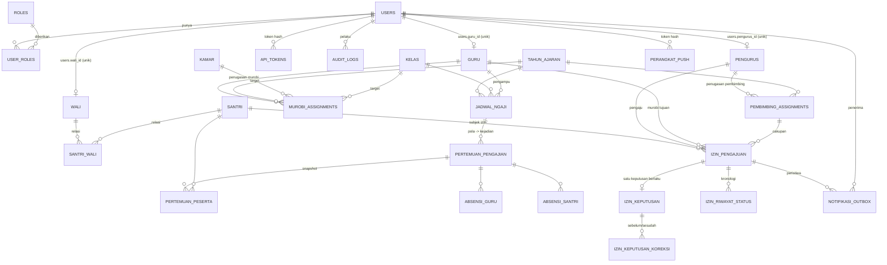
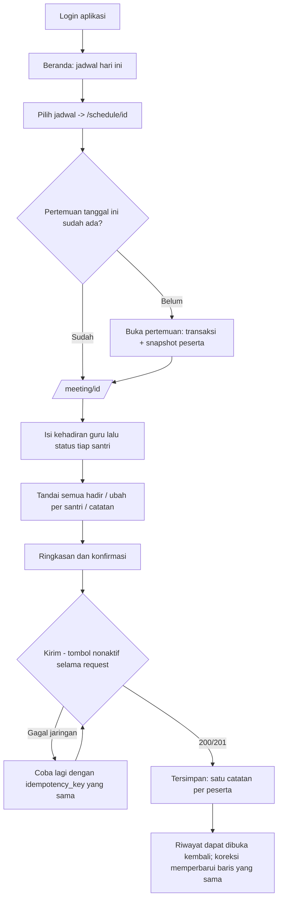
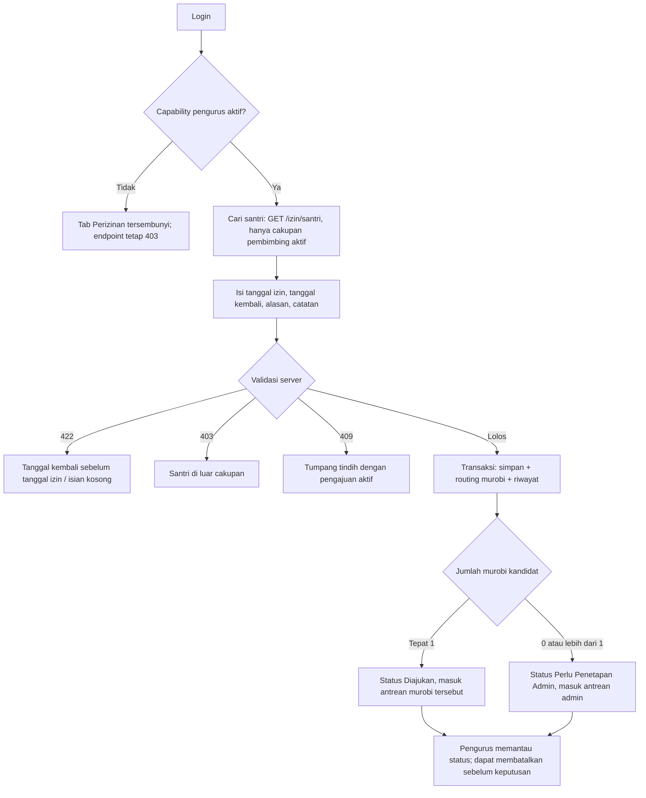
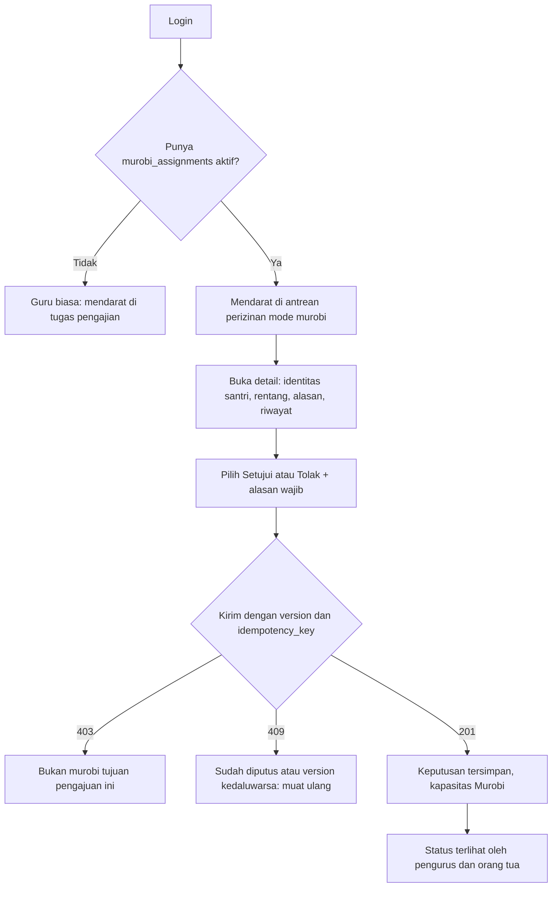
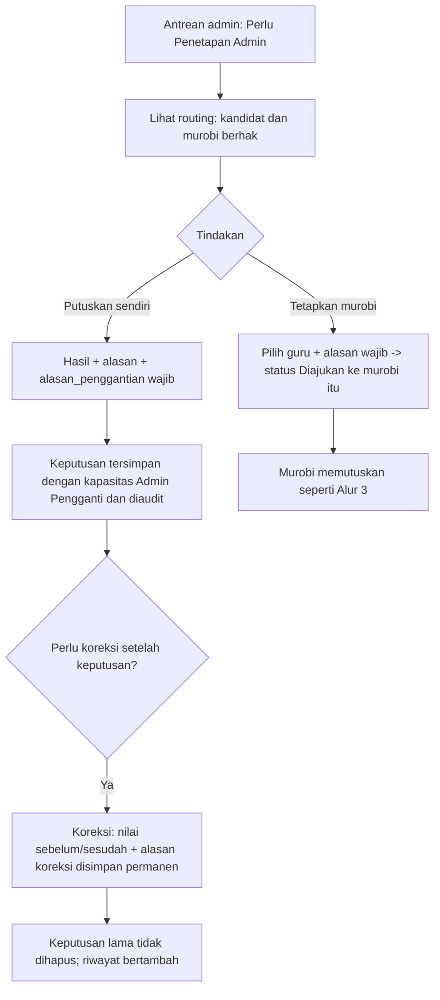
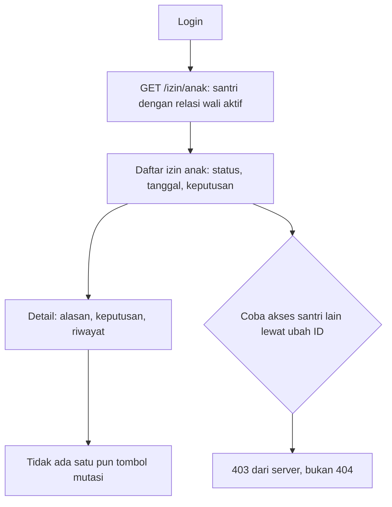
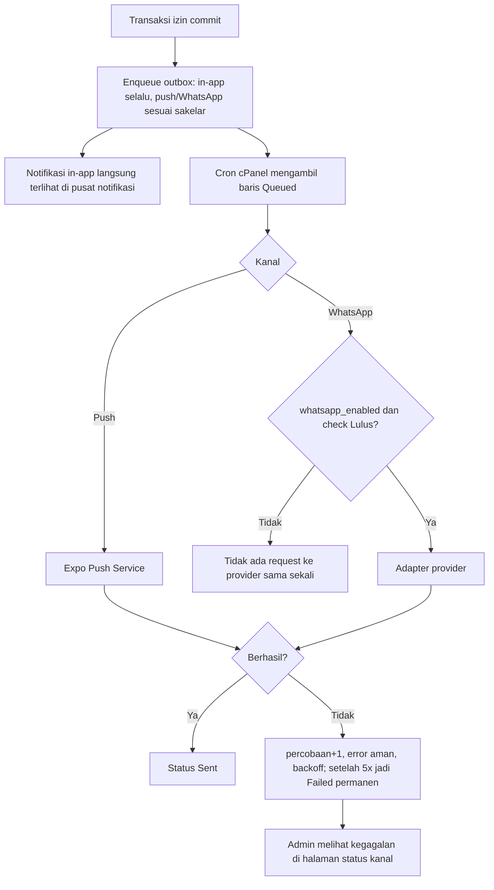

# Design Document — Sistem Informasi Pesantren Al Hasan

**Cakupan dokumen:** V1 (fondasi data, jadwal, absensi pengajian) dan V2 (perizinan santri, notifikasi multikanal).
**Status dokumen:** Draf terisi — V1 Fase 1–5 dan V2 Fase 1–3 ditulis **sebagai-terbangun (as-built)**; V2 Fase 4–5 ditulis sebagai **RENCANA**.
**Versi / tanggal:** v1.0 — 22 Agustus 2026
**Branch saat dokumen ditulis:** `prd-v2-fase-3` (commit terakhir `738b220`)
**PRD acuan:** [`PRD.md`](PRD.md) (V1) dan [`PRD-V2.md`](PRD-V2.md) (V2)
**Protokol agen:** [`AGENTS.md`](AGENTS.md)

> **Untuk agen AI:** Dokumen ini menjelaskan **bagaimana** sistem dibangun; PRD menjelaskan **apa** dan **mengapa**. Jika terjadi konflik, PRD menang. Bagian bertanda **`RENCANA`** belum ada kodenya — perlakukan sebagai usulan yang wajib dikonfirmasi Human Developer sebelum diimplementasi, bukan sebagai fakta.
>
> **Penanda status yang dipakai di seluruh dokumen:**
> `✅ TERBANGUN` = ada di kode dan sudah lolos audit fase terkait · `🔶 RENCANA` = desain usulan, belum ada kode · `⛔ TIDAK DIKERJAKAN` = eksplisit di luar ruang lingkup.

---

## Daftar Isi

1. [Konteks & Tujuan](#1-konteks--tujuan)
2. [Arsitektur Sistem](#2-arsitektur-sistem)
3. [Desain Data & Database](#3-desain-data--database)
4. [Desain Antarmuka & API](#4-desain-antarmuka--api)
5. [UI/UX & Interaksi](#5-uiux--interaksi)
6. [Keamanan & Deployment](#6-keamanan--deployment)
7. [Risiko, Trade-off, dan Alternatif yang Ditolak](#7-risiko-trade-off-dan-alternatif-yang-ditolak)
8. [Rencana Verifikasi](#8-rencana-verifikasi)
9. [Pertanyaan Terbuka & Log Keputusan](#9-pertanyaan-terbuka--log-keputusan)

---

## 1. Konteks & Tujuan

### 1.1 Masalah yang diselesaikan

| # | Masalah saat ini | Dampak operasional | Fase PRD terkait |
|---|---|---|---|
| 1 | Data guru, santri, wali, dan pengurus tersebar dan berpotensi ganda; identitas (NIS/NIP) tidak dijamin unik | Jadwal dan laporan merujuk data yang tidak konsisten; rekap manual harus dicocokkan ulang | V1 Fase 1–2 ✅ |
| 2 | Kredensial admin ditulis langsung di kode (`admin/cek_login.php`) dan tidak ada pemisahan hak akses | Siapa pun yang membaca repositori dapat masuk sebagai admin; tidak ada jejak siapa mengubah apa | V1 Fase 1 ✅ |
| 3 | Jadwal pengajian hanya menyimpan teks `jam` bebas, tanpa hari/waktu terstruktur | Bentrok guru tidak terdeteksi; jadwal tidak bisa jadi sumber tugas aplikasi | V1 Fase 3 ✅ |
| 4 | Absensi pengajian dicatat manual dan terpisah dari jadwal | Duplikasi catatan, rekap lambat, riwayat sulit dipertanggungjawabkan | V1 Fase 4 ✅ |
| 5 | Laporan absensi belum dapat difilter, dicetak, atau diekspor secara konsisten | Pertanggungjawaban ke pimpinan pesantren dibuat manual | V1 Fase 5 ✅ |
| 6 | Izin santri belum punya alur digital dari pengurus ke murobi; pengajuan tidak diarahkan otomatis | Keputusan lewat komunikasi manual, status tidak terpantau, tidak ada audit | V2 Fase 1–3 ✅ |
| 7 | Pihak terkait tidak diberi tahu saat izin diajukan atau diputuskan | Pengurus dan orang tua harus bertanya manual; keputusan terlambat diketahui | V2 Fase 4 🔶 |
| 8 | Belum ada laporan pertanggungjawaban perizinan yang dapat dicetak/diekspor | Rekap izin dibuat manual dan tidak dapat diverifikasi | V2 Fase 5 🔶 |

**Tujuan desain ini.** Menjadikan satu basis data MySQL sebagai sumber kebenaran tunggal untuk identitas, jadwal, absensi, dan perizinan; menyediakan akses yang dibatasi per peran melalui website PHP dan aplikasi Expo; serta memastikan setiap perubahan penting dapat ditelusuri dan tidak pernah terduplikasi meskipun jaringan gagal dan pengguna mencoba ulang.

### 1.2 Pengguna dan kemampuan (capability)

Capability **selalu dihitung ulang di server** oleh `App\Auth\Capabilities` dari basis data. Nama role saja tidak pernah cukup.

| Peran | Sumber kemampuan | Kanal | Yang bisa dilakukan | Yang eksplisit tidak bisa |
|---|---|---|---|---|
| **Admin** | role `admin` | Web (penuh) + App (perizinan) | Kelola seluruh master data, akun, role, jadwal, laporan; pantau semua pengajuan; tetapkan/ganti murobi; putuskan sebagai `Admin Pengganti`; koreksi keputusan | — |
| **Guru** | role `guru` + baris `guru` aktif | Web + App | Lihat jadwal miliknya, buka pertemuan, catat absensi diri & santri, lihat riwayat, cetak laporan jadwalnya | Melihat jadwal/laporan guru lain; fungsi admin |
| **Murobi** | role `guru` **dan** `murobi_assignments` aktif pada tahun ajaran aktif dan berlaku pada tanggal berjalan | Web + App | Lihat antrean pengajuan yang **diarahkan kepadanya**, setujui/tolak dengan alasan, lihat riwayat keputusan | Memutus pengajuan murobi lain; mengajukan izin; menetapkan murobi |
| **Pengurus** | role `pengurus` **dan** `users.pengurus_id` menunjuk baris `pengurus` aktif | Web + App | Lihat santri dalam cakupan `pembimbing_assignments` aktif, buat pengajuan, batalkan sebelum keputusan, pantau status | Mengajukan untuk santri di luar cakupan; memutus; menetapkan murobi |
| **Orang tua/wali** | role `orang_tua` **dan** `users.wali_id` menunjuk baris `wali` aktif | Web + App | **Baca-saja**: status dan riwayat izin santri dengan relasi `santri_wali` aktif | Semua mutasi — tidak ada satu pun endpoint mutasi terbuka untuknya |
| **Santri** | — | — | Tidak punya akun (V1 & V2) | Semua |

**Pembimbing bukan peran login.** Pembimbing adalah **penugasan pengurus** (`pembimbing_assignments`) terhadap kamar atau kelas pada satu tahun ajaran; ia menentukan cakupan santri yang boleh diajukan pengurus. Pembimbing bukan guru dan bukan murobi.

**Akun multi-kemampuan.** Satu akun dapat memiliki lebih dari satu capability (mis. guru-murobi yang juga admin). Akun seperti itu memakai **satu sesi** dan berpindah cakupan lewat parameter `mode` — di web melalui `portal_mode_switcher()`, di aplikasi melalui `components/mode-switcher.tsx`. `mode` hanya dapat **mempersempit** ke kemampuan yang benar-benar dimiliki; nilai di luar kemampuan diabaikan dan server memakai default. Manipulasi parameter tidak pernah menaikkan hak akses.

### 1.3 Di luar ruang lingkup

**Sudah selesai dan tidak dibuka kembali (V1):** semua kriteria penerimaan Fase 1–5 terverifikasi 20 Agustus 2026.

**Status pengembangan V2:**

- V2 Fase 4 — notifikasi in-app dan push sudah diimplementasikan serta diterima berdasarkan audit otomatis dan uji perangkat fisik. WhatsApp tetap opsional, default `OFF`, dan **DITANGGUHKAN/NON-BLOCKING** berdasarkan keputusan produk 26 Agustus 2026; pengiriman nyata tidak diuji dan tidak dinyatakan lulus. Temuan terbuka cron, push receipt, deep-link fisik, dan commit mobile dicatat pada `docs/phase-v2-4/acceptance-status.md`.
- V2 Fase 5 — laporan perizinan, migrasi produksi, kesiapan rilis. 🔶 Belum dikerjakan.

**⛔ Tidak dikerjakan sama sekali (kedua versi):**

| Hal | Alasan |
|---|---|
| Akun/portal untuk santri | Keputusan pengguna; santri tetap sebagai data, bukan pengguna |
| Orang tua mengajukan izin | V2 §4: orang tua hanya melihat status dan riwayat |
| Persetujuan berjenjang murobi → admin | V2 §4: cukup satu keputusan oleh murobi atau admin pengganti |
| Konseling, pelanggaran, tagihan/pembayaran, PSB baru, rapor | Di luar V1 dan V2 |
| GPS, QR, biometrik, pengenalan wajah, bukti foto, lampiran dokumen | V1 §4 dan V2 §4 |
| Mode offline penuh | V1 §4: kegagalan jaringan ditampilkan jelas + retry idempoten |
| Migrasi backend ke Laravel | `[JANGAN DIUBAH]` |
| Desain ulang penuh website publik | `[JANGAN DIUBAH]` |
| WebSocket / server push realtime | Tidak dibutuhkan; hosting cPanel, notifikasi lewat outbox + cron |

**Batasan yang diwarisi dari PRD (jangan dibuka kembali tanpa persetujuan pengguna):**

- [x] Backend tetap PHP native modular + MySQL; tidak migrasi ke Laravel.
- [x] Mobile tetap Expo 57 / React Native 0.86 / Expo Router / React 19 / TypeScript strict.
- [x] Website tetap memakai pola visual Bootstrap 5.3 yang sudah ada.
- [x] Murobi adalah guru dengan penugasan murobi aktif — bukan role tersendiri.
- [x] Pembimbing adalah tugas pengurus — bukan guru, bukan murobi.
- [x] Kontrak endpoint V1 yang dipakai aplikasi guru tidak boleh berubah; penambahan V2 bersifat aditif.
- [x] Semua perubahan skema bersifat aditif; tidak ada `DROP`/`DELETE`/`TRUNCATE` terhadap data lama.
- [x] Tabel `perizinan` lama tetap ada dan tidak diubah sampai pengguna menyetujui pensiunnya.

### 1.4 Kriteria keberhasilan

| # | Metrik | Target | Cara diverifikasi | Status |
|---|---|---|---|---|
| 1 | Duplikasi catatan absensi/pertemuan setelah uji retry & request bersamaan | 0 | `tests/phase4_integration.php`; query duplikasi pertemuan–guru dan pertemuan–santri | ✅ |
| 2 | Duplikasi pengajuan/keputusan setelah retry & concurrency | 0 | `tests/v2_phase2_concurrency_worker.php`, `tests/v2_phase3_concurrency_worker.php` | ✅ |
| 3 | Akses lintas role atau lintas cakupan | 0 | Matriks §6.2 + `tests/v2_phase3_api_contract.php` | ✅ |
| 4 | Halaman pertama laporan absensi pada ≥ 1.000 catatan | ≤ 2 detik | `tests/phase5_integration.php` dengan fixture | ✅ |
| 5 | Halaman pertama laporan perizinan pada ≥ 1.000 pengajuan | ≤ 2 detik | Fixture Fase 5 | 🔶 |
| 6 | ID dan nilai bisnis `perizinan` lama sebelum vs sesudah migrasi | Identik | `bin/v2_phase1_verify.php` | ✅ (sandbox) |
| 7 | Notifikasi in-app & push terkirim pada percobaan pertama | ≥ 95% | Statistik outbox saat masa uji | 🔶 |
| 8 | Kegagalan transaksi izin yang disebabkan kanal notifikasi | 0 | Uji dengan provider dimatikan | 🔶 |
| 9 | Secret provider muncul di respons API/log/audit/DB/bundle | 0 kejadian | Grep bundle + review log | 🔶 |

---

## 2. Arsitektur Sistem

### 2.1 Peta komponen

```
┌─────────────────────────────┐        ┌──────────────────────────────────────┐
│  Aplikasi Expo (alhasanApps)│        │  Browser                             │
│  Android · iOS · Expo Web   │        │  Admin · Pengurus · Murobi · Ortu     │
└──────────────┬──────────────┘        └──────────────────┬───────────────────┘
               │ Authorization: Bearer <token>            │ Session cookie + CSRF
               │ JSON  /api/v1/*                          │ HTML (Bootstrap 5.3)
               ▼                                          ▼
      ┌──────────────────────────────────────────────────────────────────┐
      │  WebAlHasan — PHP native modular (cPanel)                        │
      │                                                                  │
      │  api/v1/index.php ──┐                admin/*.php ── portal/*.php │
      │                     │                     │              │       │
      │            app/Api/*│          app/Auth/{PortalGuard,Authorization,
      │                     │           Capabilities,LandingRouter}       │
      │                     └────────────┬────────────────────────┘       │
      │         app/{Izin,Schedule,Report,MasterData,Account}/*Service    │
      │                                  │                                │
      │              app/*/*Repository  ─┴─  app/Audit/AuditLogger        │
      │              app/Http/{Session,Csrf,JsonResponse,Request}         │
      │              app/Database/{Connection,Migrator,BackupWriter}      │
      └──────────────────────────────┬───────────────────────────────────┘
                                     │ PDO prepared statement
                                     ▼
                             ┌───────────────┐
                             │  MySQL 8      │
                             │  (cPanel)     │
                             └───────┬───────┘
                                     │ 🔶 Fase 4
                             ┌───────┴────────────┐
                             │ Cron cPanel worker │
                             │ notifikasi_outbox  │
                             └───┬────────────┬───┘
                                 ▼            ▼
                     [Expo Push Service]  [Adapter WhatsApp — opsional, default OFF]
```

**Prinsip pemisahan lapisan (`AGENTS`/PRD §5.2).** File baru tidak boleh menggabungkan kredensial, query, aturan bisnis, dan HTML dalam satu blok. Urutan yang dipakai konsisten: `bootstrap` → `guard/auth` → `service` → `repository` → `view` atau `api controller`. Direktori `app/`, `bin/`, `database/`, `docs/`, `storage/`, `tests/` diblokir dari akses web oleh `.htaccess`.

**Modul PHP per domain:**

| Namespace | Isi | Fase |
|---|---|---|
| `App\Database` | `Connection`, `Migrator`, `BackupWriter` | V1-1 ✅ |
| `App\Support` | `Env` | V1-1 ✅ |
| `App\Http` | `Session`, `Csrf`, `Request`, `JsonResponse` | V1-1 ✅ |
| `App\Auth` | `AuthService`, `AuthRepository`, `Authorization`, `TokenHasher`, `ApiTokenAuthenticator`, `Capabilities`, `PortalGuard`, `LandingRouter` | V1-1 ✅ / V2-1 ✅ |
| `App\Audit` | `AuditLogger` | V1-1 ✅ |
| `App\MasterData` | `MasterDataService/Repository/Exception`, `Normalizer`, `PhotoStorage` | V1-2 ✅ |
| `App\Account` | `AccountService/Repository`, `PerizinanAccountService/Repository` | V1-1 ✅ / V2-1 ✅ |
| `App\Schedule` | `ScheduleService/Repository/Exception`, `LegacyTimeParser` | V1-3 ✅ |
| `App\Api` | `ApiAuthService/Repository`, `TeacherService/Repository`, `IzinApiService`, `ApiException` | V1-4 ✅ / V2-3 ✅ |
| `App\Report` | `ReportService/Repository`, `ReportFilter`, `CsvExport`, `PrintRenderer` | V1-5 ✅ |
| `App\Izin` | `IzinService`, `IzinWorkflowService`, `IzinRouter`, `IzinRepository`, `IzinWriteRepository`, `IzinIdempotency`, `PembimbingService/Repository`, `IzinException` | V2-1/2 ✅ |
| `App\Notifikasi` 🔶 | `NotifikasiService`, `OutboxRepository`, `PushSender`, `WhatsAppAdapter`, `PengaturanKanalService` | V2-4 🔶 |

### 2.2 Tech stack

| Lapisan | Teknologi | Versi | Catatan |
|---|---|---|---|
| Backend | PHP native modular, PSR-4 manual via `app/bootstrap.php` | Sandbox PHP 8.4; versi cPanel wajib dicek sebelum deploy | Tidak ada framework |
| Database | MySQL (InnoDB, `utf8mb4_unicode_ci`) | cPanel | Prepared statement (PDO) |
| Migrasi | Skrip SQL berurutan + `bin/migrate.php` | 001–007 | Setiap migrasi punya pasangan di `database/rollbacks/` |
| UI web publik | Bootstrap 5.3.0 (CDN), Font Awesome 6.0.0, Poppins, AOS 2.3.1 | — | `header.php` / `footer.php` |
| UI web admin/portal | Bootstrap 5.3.0 + Font Awesome | — | `admin/sidebar.php`, `portal/_ui.php` |
| Mobile | Expo `~57.0.15`, React Native `0.86.2`, React `19.2.3`, Expo Router `~57.0.15` | TypeScript `~6.0.3` strict | `experiments: typedRoutes, reactCompiler` |
| Navigasi mobile | `NativeTabs` dari `expo-router/unstable-native-tabs` | — | Tab dideklarasikan statis, hanya `hidden` yang berubah |
| Penyimpanan token | `expo-secure-store` `~57.0.1` | — | Token mentah tidak pernah di AsyncStorage/plain |
| Cetak mobile | `expo-print` + `expo-sharing` + `expo-web-browser` | `~57.0.x` | Cetak/PDF diambil dari server |
| Animasi | `react-native-reanimated` 4.5.1, `react-native-worklets` 0.10.1 | — | Dipakai terbatas (`animated-icon`) |
| Push 🔶 | `expo-notifications` | Belum dipasang | V2 Fase 4 |
| WhatsApp 🔶 | Adapter provider vendor-agnostik | — | Default `OFF`, lewat outbox + cron |

**Dependensi baru yang diusulkan untuk Fase 4 🔶:** `expo-notifications` saja. Tidak ada SDK vendor WhatsApp yang di-*bundle* ke aplikasi — pengiriman WhatsApp sepenuhnya di sisi server melalui HTTP request dari worker cron, sehingga mengganti vendor tidak memerlukan rilis aplikasi baru.

### 2.3 Integrasi eksternal

| Integrasi | Dipakai untuk | Wajib/opsional | Perilaku saat gagal | Kendali |
|---|---|---|---|---|
| CDN jsDelivr / cdnjs / Google Fonts | Bootstrap, Font Awesome, Poppins pada halaman web | Wajib untuk tampilan | Halaman tetap fungsional tanpa gaya; tidak memengaruhi data | — |
| Expo Push Service 🔶 | Pengiriman push ke perangkat | Opsional | Baris outbox `Failed` + retry backoff; transaksi izin tidak terpengaruh | `pengaturan_notifikasi.push_enabled` (default `0`) |
| Provider WhatsApp 🔶 | Pemberitahuan keputusan ke orang tua/pengurus | Opsional, default OFF | Tidak ada request sama sekali bila OFF; bila ON dan gagal → outbox `Failed` + retry | `pengaturan_notifikasi.whatsapp_enabled`, dijaga CHECK constraint: hanya boleh `1` bila `whatsapp_check_status = 'Lulus'` |

**Aturan tak-boleh-dilanggar.** Kegagalan kanal notifikasi **tidak pernah** membatalkan transaksi pengajuan/keputusan. Transaksi perizinan adalah sumber kebenaran; notifikasi adalah efek samping yang dijalankan setelah commit.

### 2.4 Model pemrosesan

Tidak ada WebSocket. Semua interaksi pengguna adalah request–response; pekerjaan lambat dipindahkan ke cron.

| Proses | Sinkron/Asinkron | Pemicu | Transaksi | Idempoten | Status |
|---|---|---|---|---|---|
| Login web / API | Sinkron | Aksi pengguna | — | — | ✅ |
| Buka pertemuan + snapshot peserta | Sinkron | Guru/admin | Ya | Unique `(jadwal_id, tanggal_pertemuan)` | ✅ |
| Simpan satu daftar absensi (guru + seluruh santri) | Sinkron | Guru | Ya | `api_idempotency_keys (user_id, idempotency_key)` | ✅ |
| Buat pengajuan izin + routing murobi | Sinkron | Pengurus/admin | Ya | `izin_idempotency_keys (user_id, operation, idempotency_key)` + `request_hash` | ✅ |
| Keputusan / penetapan murobi / pembatalan / koreksi | Sinkron | Murobi/admin/pengurus | Ya + optimistic `version` | Sama seperti di atas | ✅ |
| Ekspor CSV & halaman cetak | Sinkron | Admin/guru | — | — | ✅ |
| Enqueue notifikasi ke outbox 🔶 | Sinkron, **setelah commit** | Peristiwa perizinan | Tidak (di luar transaksi utama) | Unique `(event_key, kanal, penerima_user_id)` | 🔶 |
| Kirim push 🔶 | Asinkron | Cron cPanel | — | Sama; status `Queued→Sent/Failed` | 🔶 |
| Kirim WhatsApp 🔶 | Asinkron | Cron cPanel | — | Sama | 🔶 |

**Strategi retry worker 🔶 (usulan):** maksimal 5 percobaan per baris outbox dengan backoff eksponensial 1 → 5 → 15 → 60 → 240 menit; setelah itu status `Failed` permanen dan muncul di halaman admin. `percobaan`, `percobaan_terakhir_pada`, dan `error_terakhir` (pesan aman, tanpa secret) sudah disediakan kolomnya di migrasi 006.

---

## 3. Desain Data & Database

### 3.1 Tabel yang ditambah atau diubah

#### V1 — tabel baru ✅

| Tabel | Migrasi | Tujuan | Unique constraint utama |
|---|---|---|---|
| `roles` | 001 | Katalog role ternormalisasi | `roles_slug_unique (slug)` |
| `user_roles` | 001 | Relasi akun–role, mencatat `assigned_by` | pasangan user–role |
| `api_tokens` | 001 | Bearer token aplikasi, disimpan **hash** | `api_tokens_hash_unique (token_hash)` |
| `audit_logs` | 001 | Pelaku, aksi, entitas, waktu, ringkasan sebelum/sesudah | — |
| `wali` | 002 | Orang tua/wali dinormalisasi dari kolom ayah/ibu di `santri` | `wali_legacy_source_unique (legacy_santri_id, legacy_hubungan)` |
| `santri_wali` | 002 | Relasi banyak-ke-banyak wali–santri | `santri_wali_relation_unique (santri_id, wali_id, hubungan, active_guard)` |
| `pengurus` | 002 | Master pengurus (tanpa akun pada V1) | `pengurus_identitas_unique (nomor_identitas)` |
| `murobi_assignments` | 002 | Penugasan guru sebagai murobi per kamar/kelas + tahun ajaran | `murobi_assignment_unique (guru_id, tahun_ajaran_id, target_key, tanggal_mulai)` |
| `jadwal_jam_migration_report` | 003 | Laporan nilai `jam` lama yang gagal diparsing | `jadwal_jam_report_unique (jadwal_id)` |
| `pertemuan_pengajian` | 003 | Kejadian bertanggal dari pola jadwal mingguan | `pertemuan_schedule_date_unique (jadwal_id, tanggal_pertemuan)` |
| `pertemuan_peserta` | 003 | **Snapshot** daftar santri saat pertemuan dibuka | `pertemuan_participant_unique (pertemuan_id, santri_id)` |
| `absensi_guru` | 004 | Kehadiran guru per pertemuan | `absensi_guru_meeting_teacher_unique (pertemuan_id, guru_id)` |
| `absensi_santri` | 004 | Kehadiran santri per pertemuan | `absensi_santri_meeting_student_unique (pertemuan_id, santri_id)` |
| `api_idempotency_keys` | 004 | Idempotensi mutasi API V1 | `api_idempotency_user_key_unique (user_id, idempotency_key)` |

#### V1 — perubahan aditif pada tabel lama ✅

| Tabel | Perubahan penting | Kegunaan |
|---|---|---|
| `users` | `+force_password_change`, `UNIQUE users_guru_unique (guru_id)` | Password sementara wajib diganti; satu akun guru ↔ tepat satu guru |
| `guru` | `+is_active`, `+archived_at`, `+created_at/updated_at`, kolom generated `nip_unique_key = NULLIF(TRIM(nip),'')` + `UNIQUE guru_nip_unique` | NIP unik **hanya bila terisi** — trik kolom generated menghindari benturan pada NIP kosong |
| `santri` | `+is_active`, `+archived_at`, timestamp | Nonaktif/arsip menggantikan hapus permanen |
| `tahun_ajaran` | `+archived_at`, timestamp, kolom generated `active_guard`, `UNIQUE tahun_semester_unique (tahun, semester)`, `UNIQUE tahun_single_active_unique (active_guard)` | **Tepat satu** tahun ajaran aktif ditegakkan basis data, bukan hanya validasi PHP |
| `kelas` | `+is_active`, `+archived_at`, `UNIQUE kelas_name_level_unique (nama_kelas, jenjang)` | — |
| `plotting_kelas` | `+tanggal_mulai/selesai`, `+status`, `+created_by`, generated `active_year_guard`, `UNIQUE plotting_kelas_one_active_unique (id_santri, active_year_guard)` | Satu santri hanya satu kelas aktif per tahun ajaran; keanggotaan historis tetap tersimpan |
| `jadwal_ngaji` | `+hari` (ENUM), `+waktu_mulai/waktu_selesai` (TIME), `+jam_migration_status/note`, `+is_active`, `+archived_at`, `+created_by/updated_by`, 4 indeks slot | Pola mingguan terstruktur; deteksi bentrok guru/kelas/tempat. Kolom `jam` lama **tidak dihapus** |

#### V2 — tabel baru ✅ (migrasi 006 & 007)

| Tabel | Migrasi | Tujuan | Kunci penting |
|---|---|---|---|
| `pembimbing_assignments` | 006 | Penugasan **pengurus** ke kamar/kelas per tahun ajaran | `UNIQUE (pengurus_id, tahun_ajaran_id, target_key, tanggal_mulai)`; CHECK memastikan tepat satu dari `kamar_id`/`kelas_id` terisi |
| `izin_pengajuan` | 006 (+kolom routing/pembatalan di 007) | Pengajuan izin V1-warisan dan V2 dalam satu tabel | `UNIQUE izin_pengajuan_legacy_unique (legacy_perizinan_id)`; CHECK `tgl_kembali >= tgl_izin` |
| `izin_keputusan` | 006 (+`dikoreksi_pada`, `jumlah_koreksi` di 007) | **Satu** keputusan berlaku per pengajuan | `UNIQUE izin_keputusan_pengajuan_unique (pengajuan_id)`; CHECK `Admin Pengganti` wajib punya `alasan_penggantian` |
| `izin_riwayat_status` | 006 | Kronologi lengkap, tidak pernah ditimpa | — (append-only) |
| `izin_keputusan_koreksi` | 007 | Nilai sebelum/sesudah setiap koreksi | CHECK `alasan_koreksi` tidak kosong |
| `izin_idempotency_keys` | 006 | Idempotensi mutasi perizinan | `UNIQUE (user_id, operation, idempotency_key)` + `request_hash` untuk membedakan retry dari konflik |
| `notifikasi_outbox` | 006 | Antrean in-app/push/WhatsApp | `UNIQUE notifikasi_event_channel_recipient_unique (event_key, kanal, penerima_user_id)` |
| `perangkat_push` | 006 | Token perangkat, **hanya hash** yang disimpan | `UNIQUE perangkat_push_token_unique (token_hash)` |
| `pengaturan_notifikasi` | 006 | Sakelar kanal, baris tunggal | `UNIQUE (singleton)`; CHECK `whatsapp_enabled = 0 OR whatsapp_check_status = 'Lulus'` |

`users` ditambah `pengurus_id` dan `wali_id` dengan **unique + FK**, sehingga satu akun terhubung ke tepat satu baris `pengurus` atau `wali`. Role `pengurus` dan `orang_tua` ditambahkan lewat `INSERT … ON DUPLICATE KEY UPDATE` pada `roles`. Tabel `perizinan` lama **tidak diubah dan tidak dihapus**.

### 3.2 ERD ringkas



### 3.3 Aturan integritas

| Aturan bisnis | Ditegakkan oleh | Respons |
|---|---|---|
| Satu catatan absensi per (pertemuan, santri) | `UNIQUE absensi_santri_meeting_student_unique` | `409` |
| Satu catatan absensi per (pertemuan, guru) | `UNIQUE absensi_guru_meeting_teacher_unique` | `409` |
| Satu pertemuan per (jadwal, tanggal) | `UNIQUE pertemuan_schedule_date_unique` | `409` |
| Tepat satu tahun ajaran/semester aktif | Kolom generated `active_guard` + `UNIQUE tahun_single_active_unique` | `422` |
| Satu santri satu kelas aktif per tahun ajaran | Generated `active_year_guard` + `UNIQUE plotting_kelas_one_active_unique` | `422` |
| NIP unik hanya bila terisi | Generated `nip_unique_key` + `UNIQUE guru_nip_unique` | `409` |
| NIS unik | `UNIQUE KEY nis` pada `santri` — sudah ada di skema lama, tidak ditambah migrasi | `409` |
| Satu akun ↔ satu guru / satu pengurus / satu wali | `UNIQUE users_guru_unique`, `users_pengurus_unique`, `users_wali_unique` | `409` |
| Pengajuan izin tumpang tindih untuk santri yang sama | Validasi service + indeks `izin_pengajuan_overlap_index (santri_id, status, tgl_izin, tgl_kembali)` | `409` |
| `tgl_kembali >= tgl_izin` | CHECK `izin_pengajuan_range_check` + validasi service | `422` |
| Satu keputusan berlaku per pengajuan | `UNIQUE izin_keputusan_pengajuan_unique` | `409` |
| `Admin Pengganti` wajib mengisi alasan penggantian | CHECK `izin_keputusan_pengganti_check` + validasi service | `422` |
| Koreksi wajib beralasan | CHECK `izin_koreksi_alasan_check` | `422` |
| Target pembimbing tepat satu dari kamar/kelas | CHECK `pembimbing_target_check` | `422` |
| WhatsApp hanya bisa ON setelah pemeriksaan lulus | CHECK `pengaturan_notifikasi_whatsapp_check` | `422` |
| Retry mutasi dengan kunci & isi sama | `UNIQUE izin_idempotency_unique` + `request_hash` | `200` + `idempotent_replay: true` |
| Kunci idempotensi sama dengan isi berbeda | Perbandingan `request_hash` | `409` |
| Dua keputusan bersamaan | Transaksi + optimistic `izin_pengajuan.version` | Satu `201`, satu `409` |

**Catatan desain.** Aturan-aturan di atas sengaja ditegakkan di **basis data** bila memungkinkan, bukan hanya di PHP. Alasannya: modul lama, skrip `bin/`, dan impor CSV dapat menulis ke tabel yang sama tanpa melewati service baru; constraint adalah satu-satunya lapisan yang tidak bisa dilewati.

**Operasi yang wajib dalam satu transaksi:** buka pertemuan + snapshot peserta · simpan satu daftar absensi · buat pengajuan + routing + riwayat · keputusan + perubahan status + riwayat · penetapan murobi · pembatalan · koreksi.

**Optimistic version** dipakai pada `izin_pengajuan.version` untuk keputusan, penetapan murobi, pembatalan, dan koreksi. Klien mengirim `version` yang ia lihat; server menolak `409` bila sudah berubah.

### 3.4 Strategi migrasi

| Item | Isi |
|---|---|
| Berkas | `database/migrations/001…007_*.sql`, pasangan di `database/rollbacks/` |
| Runner | `php bin/migrate.php` (mencatat nama migrasi + waktu penerapan); `php bin/migrate.php status` menampilkan 001…007 |
| Sifat | **Aditif seluruhnya**. Tidak ada `DROP TABLE`, `DROP COLUMN`, `DELETE`, atau `TRUNCATE` terhadap data lama |
| Idempotensi | Migrasi 007 membungkus setiap pernyataan dalam pemeriksaan `INFORMATION_SCHEMA`, sehingga aman dijalankan berulang |
| Preflight | `bin/preflight.php`, `bin/phase3_preflight.php`, `bin/v2_phase1_preflight.php`, `bin/v2_phase2_preflight.php` — backup + manifest jumlah baris + laporan duplikasi/relasi yatim |
| Backfill | `bin/v2_phase1_backfill.php` membaca blok `BACKFILL:BEGIN…END` di migrasi 006; idempoten, tidak pernah menduplikasi baris yang sudah termigrasi |
| Verifikasi | `bin/v2_phase1_verify.php`, `bin/v2_phase2_verify.php`, `bin/verify_restore.php` |
| Uji restore | Wajib pada database bersufiks `_test` sebelum produksi |
| Rollback | Berkas di `database/rollbacks/` + prosedur di `docs/phase-*/migration-and-rollback.md` |

**Pemetaan data lama `perizinan` → `izin_pengajuan`:**

| Sumber lama | Target baru | Aturan |
|---|---|---|
| `perizinan.id` | `izin_pengajuan.id` **dan** `legacy_perizinan_id` | ID dipertahankan; `AUTO_INCREMENT` diselaraskan agar pengajuan baru tidak memakai ulang ID warisan |
| `id_santri`, `tgl_izin`, `tgl_kembali`, `alasan` | kolom senama | Disalin apa adanya |
| `status = 'Pending'` | `'Diajukan'` | Pemetaan status |
| `status = 'Disetujui' / 'Ditolak'` | tetap | — |
| pengurus, murobi, pelaku keputusan | `NULL` + `is_legacy = 1` | **Tidak mengarang pelaku**; UI menampilkan label "Data warisan" |
| — | satu baris `izin_riwayat_status` dengan `peristiwa = 'migrasi_warisan'` | Jejak bahwa baris berasal dari V1 |

**Prasyarat migrasi 006:** laporan relasi yatim untuk `perizinan.id_santri` harus **nol** — migrasi memasang FK ke `santri`, jadi baris yatim akan menggagalkan migrasi (sengaja, agar data rusak tidak lolos diam-diam).

**Kolom/tabel lama yang TIDAK dihapus sampai pengguna menyetujui:** tabel `perizinan`, kolom `jadwal_ngaji.jam`, kolom ayah/ibu di `santri`, modul `admin/admin_izin.php` (dialihkan, bukan dihapus).

### 3.5 Performa

Indeks ditambahkan **hanya setelah** pola query diketahui, bukan spekulatif.

| Query / halaman | Indeks | Migrasi | Hasil |
|---|---|---|---|
| Laporan absensi per rentang tanggal | `pertemuan_date_schedule_report_index (tanggal_pertemuan, jadwal_id)` | 005 | Halaman pertama ≤ 2 detik pada ≥ 1.000 catatan ✅ |
| Rekap status absensi guru | `absensi_guru_status_meeting_report_index (status, pertemuan_id)` | 005 | ✅ |
| Rekap status absensi santri | `absensi_santri_status_meeting_report_index (status, pertemuan_id)` | 005 | ✅ |
| Deteksi bentrok jadwal guru/kelas/tempat | `jadwal_teacher_slot_index`, `jadwal_class_slot_index`, `jadwal_place_slot_index` | 003 | ✅ |
| Antrean murobi/admin | `izin_pengajuan_antrean_index (status, murobi_guru_id, id)` | 007 | ✅ |
| Cek tumpang tindih izin | `izin_pengajuan_overlap_index (santri_id, status, tgl_izin, tgl_kembali)` | 007 | ✅ |
| Pusat notifikasi per pengguna 🔶 | `notifikasi_penerima_index (penerima_user_id, dibaca_pada, id)` | 006 (sudah ada) | 🔶 belum diukur |
| Worker outbox 🔶 | `notifikasi_status_index (status, kanal, percobaan)` | 006 (sudah ada) | 🔶 belum diukur |
| Laporan perizinan Fase 5 🔶 | Ditentukan setelah `EXPLAIN` pada fixture ≥ 1.000 pengajuan | — | 🔶 |

---

## 4. Desain Antarmuka & API

### 4.1 Konvensi API

| Aspek | Aturan |
|---|---|
| Prefix | `/api/v1` — seluruh penambahan V2 **aditif** |
| Envelope sukses | `{"success":true,"data":…,"error":null}` |
| Envelope gagal | `{"success":false,"data":null,"error":{"code":"…","message":"…","details":{}}}` |
| Autentikasi | `Authorization: Bearer <token>` untuk semua endpoint kecuali `POST /auth/login` dan `GET /` |
| Masa berlaku token | 30 hari (`API_TOKEN_TTL_DAYS`), disimpan sebagai hash di `api_tokens` |
| Pencabutan | `POST /auth/logout` mencabut token yang dipakai; setelahnya selalu `401` |
| Pagination | `page` (mulai 1), `per_page` (1–100, default 20); metadata `pagination.{current_page,per_page,total,total_pages}` |
| Tanggal | `YYYY-MM-DD`, rentang inklusif |
| Cakupan | Parameter opsional `mode` (`admin`/`pengurus`/`murobi`/`orang_tua`) hanya **mempersempit**; nilai di luar kemampuan diabaikan |

**Kontrak status HTTP:**

| Status | Kode error | Arti dan tindak lanjut klien |
|---|---|---|
| `200` | — | Berhasil, atau pemutaran ulang kunci idempotensi yang sama |
| `201` | — | Sumber daya baru dibuat |
| `401` | `UNAUTHENTICATED` | Token tidak ada/tidak valid/kedaluwarsa/dicabut → hapus token lokal, minta login ulang |
| `403` | `FORBIDDEN` | Di luar cakupan/kemampuan → muat ulang cakupan, jangan ulangi |
| `404` | `NOT_FOUND` | Rute tidak dikenal |
| `409` | `CONFLICT` | Tumpang tindih, keputusan kedua, versi kedaluwarsa, kunci idempotensi untuk isi berbeda → muat ulang lalu ulangi dengan versi terbaru |
| `422` | `VALIDATION_FAILED` | Isian tidak valid, alasan wajib kosong, `idempotency_key` tidak dikirim |
| `500` | `SERVER_ERROR` | Aman dicoba ulang dengan kunci idempotensi yang sama |

> **Catatan penting.** Pengajuan di luar cakupan menghasilkan `403`, **bukan** `404`, supaya keberadaan pengajuan milik orang lain tidak bocor lewat pengubahan ID.

### 4.2 Daftar endpoint

**V1 — tidak berubah ✅**

| Metode | Rute | Peran | Catatan |
|---|---|---|---|
| `GET` | `/` | publik | Info API |
| `POST` | `/auth/login` | publik | Mengembalikan token + `profile` |
| `GET` | `/profile` | semua terautentikasi | Ditambah objek `capabilities` (aditif) |
| `POST` | `/auth/logout` | semua terautentikasi | Mencabut token |
| `GET` | `/schedules/today`, `/schedules`, `/schedules/{id}` | guru/admin | Jadwal milik guru login |
| `POST` | `/schedules/{id}/meetings` | guru pemilik / admin | Buka pertemuan + snapshot peserta |
| `GET` | `/meetings`, `/meetings/{id}`, `/meetings/{id}/attendance` | guru/admin | — |
| `PUT` | `/meetings/{id}/attendance` | guru pemilik / admin | Transaksi + `idempotency_key` |
| `GET` | `/reports`, `/reports/filters`, `/reports/print`, `/reports/meetings/{id}` | guru (cakupan sendiri) / admin | — |

Satu-satunya perubahan struktural pada router Fase 3: autentikasi dilakukan sekali, lalu penjaga role admin/guru diterapkan **per endpoint** via `ApiTokenAuthenticator::assertScheduleAccess()`. Perilaku bagi aplikasi guru identik.

**V2 — perizinan ✅**

| Metode | Rute | Berhak | Idempoten | Sukses |
|---|---|---|---|---|
| `GET` | `/me/capabilities` | semua terautentikasi | — | `200` |
| `GET` | `/izin/santri` | admin, pengurus | — | `200` |
| `GET` | `/izin/anak` | orang_tua | — | `200` |
| `POST` | `/izin/pengajuan` | admin, pengurus (dalam cakupan) | Ya | `201` / `200` replay |
| `GET` | `/izin/pengajuan` | semua capability | — | `200` |
| `GET` | `/izin/antrean` | semua capability | — | `200` |
| `GET` | `/izin/admin/monitor` | admin | — | `200` |
| `GET` | `/izin/pengajuan/{id}` | dalam cakupan | — | `200` |
| `GET` | `/izin/pengajuan/{id}/riwayat` | dalam cakupan | — | `200` |
| `GET` | `/izin/pengajuan/{id}/routing` | admin | — | `200` |
| `POST` | `/izin/pengajuan/{id}/penetapan-murobi` | admin | Ya | `200` |
| `POST` | `/izin/pengajuan/{id}/keputusan` | murobi tujuan, admin (`Admin Pengganti`) | Ya | `201` / `200` replay |
| `POST` | `/izin/pengajuan/{id}/pembatalan` | pengurus pemilik, admin | Ya | `200` |
| `POST` | `/izin/pengajuan/{id}/koreksi` | admin | Ya | `200` |
| `GET` | `/izin/filters` | semua capability | — | `200` |

**V2 Fase 4 — notifikasi ✅ (as-built; WhatsApp nyata ditangguhkan)**

| Metode | Rute | Berhak | Fungsi |
|---|---|---|---|
| `GET` | `/notifikasi` | semua terautentikasi | Daftar notifikasi in-app milik sendiri + `belum_dibaca` |
| `POST` | `/notifikasi/{id}/dibaca` | pemilik notifikasi | Tandai satu dibaca |
| `POST` | `/notifikasi/dibaca-semua` | pemilik | Tandai semua dibaca |
| `GET` / `POST` | `/notifikasi/perangkat` | semua terautentikasi | Daftar atau daftarkan perangkat push; token mentah disimpan terlindungi, bukan sebagai teks terbaca |
| `POST` | `/notifikasi/perangkat/pencabutan` | pemilik | Cabut perangkat; pencabutan juga terhubung dengan logout |
| `POST` | `/notifikasi/perangkat/{id}/push` | pemilik | Sakelar push per perangkat |
| `GET` | `/notifikasi/admin/status` | admin | Status kanal + hasil pemeriksaan |
| `POST` | `/notifikasi/admin/pemeriksaan` | admin | Pemeriksaan konfigurasi kanal |
| `POST` | `/notifikasi/admin/sakelar` | admin | Sakelar in-app/push/WhatsApp; WhatsApp tetap `OFF` selama ditangguhkan |
| `POST` | `/notifikasi/admin/pesan-uji` | admin | Antrekan pesan uji pada kanal yang siap |
| `POST` | `/notifikasi/admin/worker` | admin | Jalankan satu putaran worker secara terkontrol |

**V2 Fase 5 — laporan perizinan 🔶 (usulan)**

| Metode | Rute | Berhak | Fungsi |
|---|---|---|---|
| `GET` | `/izin/laporan` | sesuai cakupan | Ringkasan + detail dengan filter lengkap |
| `GET` | `/izin/laporan/filters` | sesuai cakupan | Pilihan filter yang aman ditampilkan |
| `GET` | `/izin/laporan/print` | sesuai cakupan | HTML ramah cetak untuk dibuka `expo-print`/`expo-web-browser` |

### 4.3 Contoh payload

**Buat pengajuan:**

```json
POST /api/v1/izin/pengajuan
Authorization: Bearer <token>
Content-Type: application/json

{
  "santri_id": 1,
  "tgl_izin": "2026-09-01",
  "tgl_kembali": "2026-09-03",
  "alasan": "Menghadiri acara keluarga",
  "catatan_pengurus": "Dijemput orang tua",
  "idempotency_key": "uuid-atau-kunci-unik"
}
```

```json
201 {"success":true,"data":{
  "id":1,"status":"Diajukan","murobi_guru_id":27,"routing_kandidat":1,
  "routing_catatan":"Routing otomatis: satu murobi aktif cocok (Kamar: Kamar A).",
  "idempotent_replay":false},"error":null}
```

**Keputusan (kapasitas ditentukan server, bukan dari body):**

```json
POST /api/v1/izin/pengajuan/1/keputusan
{"hasil":"Disetujui","alasan":"Alasan dan rentang tanggal wajar",
 "alasan_penggantian":"Kamar C belum memiliki murobi aktif",
 "version":1,"idempotency_key":"uuid"}
```

```json
201 {"success":true,"data":{
  "id":1,"keputusan_id":1,"status":"Disetujui","kapasitas":"Murobi","version":2,
  "idempotent_replay":false},"error":null}
```

**Profil dengan capability:**

```json
{"id":3,"name":"Pengurus A","username":"pengurus_a","guru":null,"roles":["pengurus"],
 "capabilities":{
   "list":["pengurus"],"default_mode":"pengurus",
   "konteks":{"guru_id":null,"pengurus_id":1,"wali_id":null},
   "menus":[{"key":"izin_pengurus","label":"Perizinan — Pengurus","capability":"pengurus"}],
   "aksi":{"dapat_membuat_pengajuan":true,"dapat_memutuskan":false,
           "dapat_menetapkan_murobi":false,"dapat_mengoreksi_keputusan":false,
           "dapat_membatalkan":true,"hanya_baca":false}}}
```

Dokumen kontrak lengkap: [`docs/api-v1.md`](docs/api-v1.md), [`docs/phase-v2-3/endpoint-inventory.md`](docs/phase-v2-3/endpoint-inventory.md).

### 4.4 Otorisasi per endpoint

Ringkasan matriks (lengkap di [`docs/phase-v2-3/capability-matrix.md`](docs/phase-v2-3/capability-matrix.md)):

| Endpoint | admin | pengurus | murobi | orang_tua | tanpa capability |
|---|:---:|:---:|:---:|:---:|:---:|
| `GET /profile`, `/me/capabilities` | 200 | 200 | 200 | 200 | 200 (list kosong) |
| `GET /izin/santri` | 200 | 200 | 403 | 403 | 403 |
| `GET /izin/anak` | 403 | 403 | 403 | 200 | 403 |
| `GET /izin/pengajuan`, `/izin/antrean` | 200 | 200 | 200 | 200 | 403 |
| `GET /izin/admin/monitor`, `…/routing` | 200 | 403 | 403 | 403 | 403 |
| `POST /izin/pengajuan` | 201 | 201 dalam cakupan | 403 | 403 | 403 |
| `POST …/penetapan-murobi`, `…/koreksi` | 200 | 403 | 403 | 403 | 403 |
| `POST …/keputusan` | 201 (`Admin Pengganti`) | 403 | 201 bila tujuan; 403 bila bukan | 403 | 403 |
| `POST …/pembatalan` | 200 | 200 bila miliknya | 403 | 403 | 403 |
| `GET /schedules*`, `/reports*` (V1) | 200 | 403 | 200 (role `guru`) | 403 | 200 bila role guru |

**Prinsip:** akses endpoint V1 ditentukan **role**; endpoint perizinan V2 ditentukan **capability**. Menyembunyikan tab atau tombol **bukan** kontrol akses.

### 4.5 State management & sinkronisasi

| Aspek | Website PHP | Aplikasi Expo |
|---|---|---|
| Sumber state | Server-rendered per request; filter di query string agar bisa di-bookmark | State lokal React + `useEffect`; tidak ada library state global |
| Identitas | Session PHP (`App\Http\Session`), regenerasi ID setelah login | `auth/auth-context.tsx` + `expo-secure-store` |
| Guard | `portal/_guard.php`, `admin/_guard.php`, `App\Auth\PortalGuard` | `app/_layout.tsx` mengarahkan ke `/login` bila tidak ada sesi |
| Tujuan setelah login | `App\Auth\LandingRouter` — satu sumber kebenaran untuk `cek_login.php`, `admin_login.php`, `ubah_password.php` | Tab dari `capabilities` |
| Invalidasi setelah mutasi | Redirect + flash message (`portal_flash_set`) | Refetch layar terkait setelah mutasi berhasil |
| Anti double-submit | `portal_idempotency_key()` per formulir (hidden field) + JS menonaktifkan tombol saat submit | `hooks/use-mutation-guard.ts` (`isBusy`, satu kunci per operasi) |
| Retry | Refresh POST memakai kunci yang sama → server memutar ulang | GET: 2× otomatis; mutasi: 0× otomatis, retry manual memakai kunci yang **sama** |
| Timeout | Default PHP/Apache | 20 detik per request (`AbortController`) |
| Perilaku `401` | Redirect ke login | `setUnauthorizedHandler` → hapus token → `/login` |

**Tanpa JavaScript pun web tetap benar.** Penonaktifan tombol di `portal/_ui.php` hanya peningkatan tampilan; pengaman sebenarnya adalah kunci idempotensi per formulir dan optimistic version di server.

**Tidak ada sinkronisasi offline dua arah.** Konfirmasi: benar — mode offline penuh di luar ruang lingkup V1 dan V2.

### 4.6 Pembagian logika client vs server

| Logika | Lokasi | Catatan |
|---|---|---|
| Validasi format & wajib isi | Client (UX) **dan** server (otoritatif) | Client hanya mempercepat umpan balik |
| Penentuan capability | Server (`App\Auth\Capabilities`) | Dihitung ulang dari DB setiap request; tidak pernah dari klaim klien |
| Kapasitas pemberi keputusan (`Murobi`/`Admin Pengganti`) | Server | **Tidak** diambil dari body request |
| Routing ke murobi | Server (`App\Izin\IzinRouter`) | Menilai `murobi_assignments` aktif pada tanggal pengajuan + tahun ajaran aktif + kamar/kelas aktif santri |
| Cakupan santri pengurus | Server, ikut di **query** | Bukan difilter di PHP setelah mengambil semua baris |
| Deteksi tumpang tindih & bentrok jadwal | Server | Ditopang indeks khusus |
| Kalkulasi ringkasan laporan | Server | Ringkasan, detail, cetak, dan CSV memakai `ReportFilter`/repository yang sama agar totalnya tidak pernah berbeda |
| Pembuatan kunci idempotensi | Client | Server hanya memverifikasi `(user_id, operation, key)` + `request_hash` |

---

## 5. UI/UX & Interaksi

### 5.0 Prinsip desain bersama

| Prinsip | Penerapan |
|---|---|
| Bahasa | Bahasa Indonesia; istilah persis seperti PRD |
| Status izin | `Diajukan`, `Perlu Penetapan Admin`, `Disetujui`, `Ditolak`, `Dibatalkan` |
| Status absensi | `Hadir`, `Terlambat`, `Izin`, `Sakit`, `Alpa` |
| Status pertemuan | `Draf`, `Dibuka`, `Selesai` |
| Kapasitas keputusan | `Murobi`, `Admin Pengganti` |
| Warna bukan satu-satunya penanda | Setiap status memakai **teks**; warna hanya penguat |
| Aksi final | Konfirmasi eksplisit; alasan wajib untuk penetapan ulang, pembatalan, penggantian admin, dan koreksi |
| Data warisan | Baris `is_legacy = 1` diberi label **"Data warisan"** dan pelaku ditampilkan kosong, bukan diisi nama karangan |
| Zona waktu | `Asia/Jakarta` (`APP_TIMEZONE`) |
| Nada error | Ringkas, dapat ditindaklanjuti, tidak membocorkan detail internal |

**Peta status → penanda visual:**

| Status | Badge web (`portal_status_badge`) | Token app |
|---|---|---|
| `Diajukan` | `text-bg-primary` | `primary` |
| `Perlu Penetapan Admin` | `text-bg-warning` | `warning` |
| `Disetujui` | `text-bg-success` | `success` |
| `Ditolak` | `text-bg-danger` | `danger` |
| `Dibatalkan` | `text-bg-secondary` | `textSecondary` |

---

### 5A. UI/UX Website PHP (Bootstrap)

#### 5A.1 Inventaris halaman

**Website publik ✅ (tidak didesain ulang):** `index.php`, `berita.php`, `detail.php`, `galeri.php`, `download.php`, `jadwal_ngaji.php`, `psb.php`, `biaya_psb.php`, `portal_pendaftar.php`, dan cetak PSB. Kerangka: `header.php` (navbar `fixed-top`, Poppins, AOS) + `footer.php`.

**Panel admin ✅** — kerangka `admin/sidebar.php`, penjaga `admin/_guard.php`, komponen daftar/form `admin/_master_ui.php`:

| Kelompok | Halaman | Fase |
|---|---|---|
| Autentikasi | `admin_login.php`, `cek_login.php`, `logout.php`, `ubah_password.php` | V1-1 |
| Akun & role | `admin_akun.php`, `admin_akun_perizinan.php` | V1-1 / V2-1 |
| Master data | `admin_guru.php`, `admin_master_santri.php`, `admin_wali.php`, `admin_pengurus.php`, `admin_kelas.php`, `admin_kamar.php`, `admin_tahun.php` | V1-2 |
| Penugasan | `admin_murobi.php`, `admin_pembimbing.php` | V1-2 / V2-1 |
| Jadwal & absensi | `admin_jadwal_ngaji.php`, `pertemuan_pengajian.php` | V1-3/4 |
| Laporan | `admin_laporan_absensi.php`, `laporan_absensi_detail.php`, `laporan_absensi_cetak.php`, `export_laporan_absensi.php` | V1-5 |
| Ekspor/impor | `export_master.php`, `export_santri.php`, `proses_import_santri.php`, `export_psb.php` | V1-2 |
| Perizinan lama | `admin_izin.php` — **dialihkan** ke portal baru; dibuka hanya darurat via `IZIN_LEGACY_ENABLED=true` + `?legacy=1` | V2-2 |

**Portal perizinan berbasis peran ✅** — kerangka `portal/_ui.php`, penjaga `portal/_guard.php`:

| Halaman | Isi | Akses |
|---|---|---|
| `portal/index.php` | Ringkasan sesuai cakupan | semua capability |
| `portal/izin.php` | Daftar perizinan + pencarian, filter, pagination | semua capability |
| `portal/izin_antrean.php` | Antrean tindakan (isi berbeda per mode) | semua capability |
| `portal/izin_buat.php` | Formulir pengajuan | pengurus, admin |
| `portal/izin_detail.php` | Detail + keputusan + riwayat + koreksi | dalam cakupan |
| `portal/izin_aksi.php` | Endpoint POST mutasi (CSRF + idempotency key) | sesuai kewenangan |

**Kompatibilitas URL.** URL login admin lama tetap berfungsi; `admin/admin_izin.php` mengalihkan alih-alih menghilang, sehingga bookmark lama tidak rusak.

**🔶 Halaman yang belum ada:** pusat notifikasi (`portal/notifikasi.php`), pengaturan kanal (`admin/admin_notifikasi.php`), laporan perizinan + cetak + CSV (`portal/izin_laporan.php`, `izin_laporan_cetak.php`, `export_izin.php`).

#### 5A.2 Pola layout & komponen

| Elemen | Pola | Catatan |
|---|---|---|
| Kerangka portal | `portal_header()` / `portal_footer()` | Navbar `navbar-dark bg-dark`, `container-fluid px-md-4 py-4`, body `bg-light` |
| Navigasi peran | Item menu dirender kondisional dari capability | Ada jalan kembali "Jadwal Mengajar" untuk guru dan "Panel Admin" untuk admin — satu sesi, tanpa login ulang |
| Pemilih cakupan | `portal_mode_switcher()` — `btn-group` pil, muncul hanya bila ≥ 2 capability | `?mode=` di query string, `page` di-reset |
| Daftar data | `table-responsive` + `portal_pagination()` (jendela ±2 halaman) | — |
| Filter | Form `GET` → query string; `portal_query()` menjaga parameter lain | Hasil filter dapat di-bookmark dan dibagikan |
| Form mutasi | `POST` ke `portal/izin_aksi.php` dengan `Csrf::input()` + hidden `idempotency_key` | Kunci dibuat saat form dirender, jadi refresh POST memakai kunci yang sama |
| Umpan balik | `portal_flash_set()` → `alert alert-{success,danger,info}` dengan `role="alert"` | — |
| Badge status | `portal_status_badge()` | Lihat tabel §5.0 |
| Escaping | `portal_e()` = `htmlspecialchars(ENT_QUOTES, 'UTF-8')` pada semua keluaran | — |

#### 5A.3 Responsif

| Breakpoint | Perilaku |
|---|---|
| `< 576px` | Navbar `collapse`; tabel di dalam `table-responsive` (geser horizontal di dalam kontainernya sendiri, bukan pada body); tombol aksi menumpuk |
| `576–991px` | Sidebar admin `collapse`; filter menumpuk satu kolom |
| `≥ 992px` | Navbar penuh; `container-fluid px-md-4` memakai lebar layar; filter sejajar |

#### 5A.4 Halaman ramah cetak

| Item | Isi |
|---|---|
| Sudah ada ✅ | `admin/laporan_absensi_cetak.php` — dirender `App\Report\PrintRenderer` |
| Disembunyikan saat cetak | Navbar, sidebar, tombol aksi, kontrol filter |
| Kop wajib | Identitas pesantren, jenis laporan, filter aktif, waktu pembuatan, pembuat, nomor halaman |
| Verifikasi | Total ringkasan = jumlah baris detail untuk filter yang sama; kolom utama tidak terpotong |
| 🔶 Fase 5 | Halaman cetak laporan perizinan dengan kop yang sama + keputusan dan pemberi keputusan |

#### 5A.5 Aksesibilitas web

- [x] `aria-label` pada toggler navigasi dan `aria-label="Navigasi halaman"` pada pagination.
- [x] Flash message memakai `role="alert"`.
- [x] Tombol yang sedang memproses memakai `aria-busy="true"`.
- [x] Pemilih cakupan diberi `aria-label="Pilih cakupan"`.
- [x] Status memakai teks, bukan hanya warna badge.
- [ ] 🔶 Audit kontras Bootstrap `text-bg-warning` pada latar terang belum dilakukan.

---

### 5B. UI/UX Aplikasi React Native (Expo)

#### 5B.1 Peta rute Expo Router

| Rute | Berkas | Akses | Tipe |
|---|---|---|---|
| `/login` | `src/app/login.tsx` | publik | Form |
| `/(app)/(home)` | `src/app/(app)/(home)/index.tsx` | semua terautentikasi | Beranda: jadwal hari ini & berikutnya |
| `/(app)/(izin)/perizinan` | `src/app/(app)/(izin)/perizinan.tsx` | capability perizinan | Daftar + antrean + pemilih mode |
| `/izin/buat` | `src/app/izin/buat.tsx` | pengurus, admin | Form pengajuan |
| `/izin/[id]` | `src/app/izin/[id].tsx` | dalam cakupan | Detail + aksi + riwayat |
| `/(app)/(schedules)/schedules` | `src/app/(app)/(schedules)/schedules.tsx` | guru/admin | Daftar & filter jadwal |
| `/schedule/[id]` | `src/app/schedule/[id].tsx` | guru pemilik/admin | Detail tugas pengajian |
| `/meeting/[id]` | `src/app/meeting/[id].tsx` | guru pemilik/admin | Pengisian absensi |
| `/(app)/(reports)/reports` | `src/app/(app)/(reports)/reports.tsx` | guru/admin | Laporan + filter |
| `/report/[id]` | `src/app/report/[id].tsx` | guru/admin | Detail pertemuan + cetak/bagikan |
| 🔶 `/notifikasi`, `/notifikasi/[id]` | belum ada | semua | Pusat notifikasi Fase 4 |

**Navigasi berbasis capability** (`src/components/app-tabs.tsx`):

| Kondisi | Tab yang tampil |
|---|---|
| role `guru` atau `admin` | Beranda, Jadwal, Laporan |
| `capabilities.list` tidak kosong | + Perizinan |
| hanya `pengurus` atau `orang_tua` | Beranda + Perizinan (Jadwal & Laporan disembunyikan) |
| `capabilities.list` kosong | Beranda saja, dengan pesan bahwa akun belum memiliki kemampuan perizinan |

**Keputusan desain penting.** Seluruh tab **selalu dideklarasikan**; yang berubah hanya properti `hidden`. Expo Router SDK 57 tidak mendukung menambah/menghapus tab secara dinamis, dan nilai `hidden` dihitung dari capability yang sudah dimuat **sebelum** navigator dipasang — sehingga tidak ada remount navigator di tengah pemakaian.

#### 5B.2 Komponen

| Komponen | Status | Peran |
|---|---|---|
| `themed-text.tsx` / `themed-view.tsx` | ✅ | Wajib untuk light/dark; tipe teks: `default`, `title`, `small`, `smallBold`, `subtitle`, `link`, `linkPrimary`, `code` |
| `app-button.tsx` | ✅ | Tombol dengan varian + state disabled |
| `app-tabs.tsx` (+ `.web.tsx`) | ✅ | Navigasi capability; varian web terpisah |
| `mode-switcher.tsx` | ✅ | Pemilih cakupan, `accessibilityRole="radiogroup"`/`"radio"` |
| `screen-state.tsx` | ✅ | `LoadingState`, `EmptyState`, `ErrorState` (dengan tombol "Coba lagi") |
| `status-selector.tsx` | ✅ | Pilihan status absensi |
| `schedule-card.tsx` / `izin-card.tsx` | ✅ | Kartu daftar |
| `hint-row.tsx`, `web-badge.tsx`, `external-link.tsx`, `collapsible.tsx` | ✅ | Pendukung |
| `animated-icon.tsx` (+ `.web.tsx`, `.module.css`) | ✅ | Ikon beranimasi, varian web |
| 🔶 `notification-card.tsx`, `unread-badge.tsx` | 🔶 | Fase 4 |

**Aturan:** komponen baru hanya dibuat bila tidak ada yang bisa diperluas, dan alasannya dicatat di sini.

#### 5B.3 Design token

Sumber: `src/constants/theme.ts`.

| Kebutuhan | Token | Light | Dark |
|---|---|---|---|
| Latar layar | `background` | `#F6F8F5` | `#0D1711` |
| Permukaan kartu | `card` | `#FFFFFF` | `#132019` |
| Elemen/latar sekunder | `backgroundElement` | `#E9EFEA` | `#1A2820` |
| Terpilih | `backgroundSelected` | `#D8E8DC` | `#264331` |
| Garis | `border` | `#D9E1DB` | `#2A3B30` |
| Teks utama | `text` | `#17231C` | `#F2F7F3` |
| Teks sekunder | `textSecondary` | `#5C6B61` | `#A9BAAE` |
| Aksi utama | `primary` / `onPrimary` | `#176B3A` / `#FFFFFF` | `#62C985` / `#082611` |
| Sukses | `success` | `#176B3A` | `#62C985` |
| Peringatan | `warning` | `#8B5A00` | `#F4BE62` |
| Bahaya | `danger` | `#B42318` | `#FF8A80` |

**Spacing:** `half 2 · one 4 · two 8 · three 16 · four 24 · five 32 · six 64` — jangan memakai angka lepas.
**Lebar konten maksimum:** `MaxContentWidth = 800`.
**Inset tab bawah:** `BottomTabInset` = 50 (iOS) / 80 (Android).
**Font:** `Fonts` via `Platform.select` — iOS memakai `ui-*` sistem, web memakai variabel CSS di `src/global.css`.

**Dark mode.** `app.json` menyetel `userInterfaceStyle: "automatic"`. Setiap warna baru **wajib** punya pasangan light dan dark; ambil warna hanya lewat `useTheme()`, tidak pernah literal hex di layar.

#### 5B.4 Aturan main React Native

**Sudah dipatuhi ✅**

| Aturan | Penerapan |
|---|---|
| Tidak ada CSS DOM | Semua gaya lewat `StyleSheet.create`; `global.css` hanya mendefinisikan variabel font untuk Expo Web |
| Umpan balik tekan | `Pressable` dengan `opacity` pada `pressed`; tidak ada afordans yang hanya bergantung `hover` |
| State disabled terlihat | `opacity: 0.55` + `accessibilityState.disabled` |
| Warna hanya lewat token | `useTheme()`; tidak ada literal hex di layar |
| Perbedaan platform | Berkas `.web.tsx` terpisah (`app-tabs`, `animated-icon`, `use-color-scheme`) alih-alih percabangan `if (Platform.OS)` di dalam komponen |
| Orientasi | `portrait` (dikunci di `app.json`), `supportsTablet: true` di iOS |
| Animasi | Reanimated dipakai terbatas pada `animated-icon`; tidak ada animasi berat di dalam daftar |
| Cetak | `expo-print` + `expo-sharing` + `expo-web-browser`; halaman cetak dirender **server**, aplikasi hanya membuka/membagikan |
| Jaringan | `expo/fetch` + `AbortController` 20 detik; GET retry 2×, mutasi tidak pernah retry otomatis |
| Keyboard | `login.tsx` memakai `KeyboardAvoidingView` dengan `behavior` per platform |

**Belum dipatuhi — utang teknis yang terverifikasi dari kode 🔶**

| Temuan | Risiko | Usulan perbaikan |
|---|---|---|
| Seluruh layar daftar memakai `ScrollView`, **bukan** `FlatList` — tidak ada satu pun `FlatList` di `src/` | Semua baris dirender sekaligus. Aman pada data uji, tetapi daftar perizinan/laporan yang panjang akan terasa berat dan boros memori di perangkat lama | Ganti daftar berpaginasi (`perizinan.tsx`, `reports.tsx`, `schedules.tsx`) ke `FlatList` dengan `keyExtractor` + `onEndReached` untuk halaman berikutnya |
| Tidak ada `SafeAreaView`/`useSafeAreaInsets` di `src/`, meskipun `react-native-safe-area-context` terpasang | Konten dapat tertutup notch, home indicator, atau tab bawah pada perangkat tertentu | Bungkus layar dengan safe area dan beri padding bawah sebesar `BottomTabInset` |
| `BottomTabInset` didefinisikan di `constants/theme.ts` tetapi **tidak dipakai** di mana pun | Item terakhir daftar berpotensi tertutup tab bar | Pakai sebagai `contentContainerStyle.paddingBottom` pada semua daftar |
| `MaxContentWidth` hanya dipakai di `app-tabs.web.tsx` | Di tablet dan Expo Web, konten layar melebar penuh dan baris teks menjadi terlalu panjang untuk dibaca nyaman | Terapkan pada kontainer setiap layar, bukan hanya navigasi web |
| `KeyboardAvoidingView` hanya di `login.tsx`; `izin/buat.tsx` dan `meeting/[id].tsx` belum | Keyboard dapat menutupi kolom alasan/catatan pada layar yang justru paling banyak mengetik | Tambahkan pada kedua layar form tersebut |
| Target sentuh ≥ 44×44 pt belum diaudit | Pil mode (`paddingVertical: 8` + teks 20 → ±36 pt) dan tombol ikon berpotensi di bawah ambang | Audit dan naikkan padding atau pakai `hitSlop` |

#### 5B.5 Responsif di mobile

| Konteks | Perilaku saat ini | Status |
|---|---|---|
| HP potret | Satu kolom, kartu selebar layar dikurangi padding | ✅ |
| Font sistem membesar | Teks membungkus; tidak ada tinggi tetap pada kartu | ✅ |
| Teks panjang (alasan izin) | `ThemedText selectable` agar dapat disalin, membungkus penuh tanpa terpotong | ✅ |
| Tablet / Expo Web | Konten **belum** dibatasi `MaxContentWidth` (800) — baris teks melebar penuh | 🔶 lihat §5B.4 |

#### 5B.6 Aksesibilitas mobile

- [x] `accessibilityRole="radiogroup"`/`"radio"` + `accessibilityState={{selected, disabled}}` pada pemilih mode.
- [x] `accessibilityLiveRegion="polite"` pada loading dan `"assertive"` pada error state.
- [x] Status memakai teks; warna hanya penguat.
- [x] Teks penting `selectable` agar dapat disalin.
- [ ] 🔶 `accessibilityLabel` pada seluruh tombol ikon-saja belum diaudit menyeluruh.
- [ ] 🔶 Uji VoiceOver/TalkBack end-to-end belum dilakukan.

---

### 5C. Paritas & perbedaan yang disengaja

| Fungsi | Web | Aplikasi | Alasan bila berbeda |
|---|---|---|---|
| Login, logout | ✅ | ✅ | — |
| Jadwal & absensi guru | ✅ (`pertemuan_pengajian.php`) | ✅ | — |
| Laporan absensi + filter | ✅ | ✅ | — |
| Cetak laporan | ✅ HTML ramah cetak | ✅ membuka/membagikan hasil server | Aplikasi tidak merender ulang tata letak cetak |
| Daftar & detail perizinan | ✅ | ✅ | — |
| Buat, batalkan, putuskan, tetapkan murobi, koreksi | ✅ | ✅ | Paritas penuh (V2 Fase 3) |
| Kelola master data, akun, role, tahun ajaran, kelas | ✅ | ❌ | Administrasi berat, lebih baik di layar lebar |
| Migrasi, backup, preflight | ✅ CLI `bin/*` | ❌ | Operasi server |
| 🔶 Pusat notifikasi | 🔶 | 🔶 | Paritas direncanakan |
| 🔶 Pengaturan kanal notifikasi | 🔶 | ❌ | Administrasi; web saja |

---

### 5D. Alur pengguna utama

**Alur 1 — Guru mencatat absensi pengajian ✅**



**Alur 2 — Pengurus mengajukan izin ✅**



**Alur 3 — Murobi memutuskan ✅**



**Alur 4 — Admin menetapkan murobi & memutus sebagai pengganti ✅**



**Alur 5 — Orang tua memantau ✅**



**Alur 6 — Notifikasi 🔶 (rencana Fase 4)**



---

### 5E. Edge case & state layar

| Kondisi | Web | Aplikasi | Pemulihan |
|---|---|---|---|
| Loading awal | Render server (tidak ada state loading terpisah) | `LoadingState` + `accessibilityLiveRegion="polite"` | — |
| Data kosong | Baris "tidak ada data" pada tabel | `EmptyState` (judul + penjelasan) | Longgarkan filter |
| Validasi gagal (`422`) | Flash `alert-danger` + nilai form dipertahankan | Pesan per field dari `error.details` | Perbaiki isian |
| Tidak berhak (`403`) | `PortalGuard` → 403/redirect aman | Pesan "di luar cakupan"; jangan ulangi | Muat ulang cakupan |
| Konflik (`409`) | Flash menjelaskan konflik | `actionableError()` menyarankan muat ulang | Muat ulang lalu ulangi dengan `version` terbaru |
| Sesi/token kedaluwarsa (`401`) | Redirect ke login | `setUnauthorizedHandler` → hapus token → `/login` | Login ulang |
| Jaringan gagal / timeout 20 detik | — | `ErrorState` + tombol "Coba lagi" | Retry memakai `idempotency_key` yang **sama** |
| Request sedang berjalan | Tombol `disabled` + `aria-busy` saat submit | `useMutationGuard.isBusy` mengabaikan ketukan berikutnya | — |
| Klik ganda / refresh POST | Kunci idempotensi per formulir → satu baris | Kunci sama per operasi | — |
| API belum dikonfigurasi | — | `ApiError` `CONFIG_ERROR`: "Isi `EXPO_PUBLIC_API_BASE_URL` lalu muat ulang" | Perbaiki env |
| Akun tanpa capability perizinan | Menu perizinan tidak muncul; endpoint tetap `403` | Beranda saja + pesan penjelas | Hubungi admin |
| Data warisan tanpa pelaku | Label "Data warisan", pelaku kosong | Sama | — |
| Kegagalan notifikasi 🔶 | Transaksi tetap sukses; status kanal terlihat admin | In-app tetap ada | Retry via outbox |

---

## 6. Keamanan & Deployment

### 6.1 Autentikasi

| Kanal | Mekanisme | Penyimpanan | Masa berlaku | Pencabutan |
|---|---|---|---|---|
| Website | Session PHP, ID diregenerasi setelah login | Cookie `HttpOnly`, `SameSite=Lax` atau lebih ketat, `Secure` bila HTTPS (`SESSION_SECURE_COOKIE`) | Sesi | Logout mengakhiri sesi |
| Aplikasi | Bearer token acak; server menyimpan **hash** (`api_tokens.token_hash`, di-hash dengan `API_TOKEN_HASH_SECRET`) | `expo-secure-store` di perangkat | 30 hari (`API_TOKEN_TTL_DAYS`) | `POST /auth/logout` mencabut token server + membersihkan perangkat |

**Password:** `password_hash(PASSWORD_DEFAULT)` + `password_verify()`. Password sementara memicu `users.force_password_change` dan wajib diganti pada login pertama; `bin/reset_admin_password.php` tersedia untuk pemulihan. Password mentah tidak pernah masuk log atau audit. Login gagal memakai pesan generik yang tidak mengungkap apakah username terdaftar.

**Kelayakan login API:** V1 — `admin`, atau `guru` dengan baris guru aktif. V2 Fase 3 menambah — `pengurus` dengan baris `pengurus` aktif, dan `orang_tua` dengan baris `wali` aktif. Akun tanpa relasi aktif ditolak `401`.

### 6.2 Otorisasi

| Lapisan | Pemeriksaan |
|---|---|
| Halaman admin | `admin/_guard.php` + `App\Auth\Authorization` — sesi aktif + role |
| Portal perizinan | `portal/_guard.php` + `App\Auth\PortalGuard` + `Capabilities` |
| API | `App\Auth\ApiTokenAuthenticator` (token valid) → `assertScheduleAccess()` untuk V1 → capability + kepemilikan untuk V2 |
| Repository | Filter cakupan ikut di **query**, bukan difilter di PHP setelah mengambil semua baris |

**Matriks uji otorisasi ✅ (dijalankan `tests/v2_phase3_api_contract.php` dan tes fase terkait):**

| Aktor | Aksi | Objek | Hasil |
|---|---|---|---|
| Guru A | Simpan absensi | Jadwal Guru B | `403` |
| Guru A | Lihat laporan | Jadwal Guru B | `403` |
| Akun role guru | Buka fungsi khusus admin | — | `403`/redirect aman |
| Guru tanpa penugasan murobi | Putuskan izin | Pengajuan mana pun | Tidak punya capability → `403` |
| Murobi A | Putuskan | Pengajuan murobi B | `403` |
| Pengurus | Ajukan izin | Santri di luar cakupan pembimbing | `403` |
| Pengurus A | Batalkan | Pengajuan pengurus B | `403` |
| Orang tua A | Lihat detail | Santri tanpa relasi wali aktif | `403` (bukan `404`) |
| Orang tua | Panggil endpoint mutasi apa pun | — | `403` |
| Siapa pun | Kirim `mode` di luar capability-nya | — | Diabaikan; server memakai default |
| Tanpa token / token dicabut | Endpoint terproteksi | — | `401` |

### 6.3 Perlindungan lain

- [x] CSRF (`App\Http\Csrf`) pada seluruh form mutasi web; form tanpa token valid ditolak.
- [x] Prepared statement (PDO) untuk semua query baru; tidak ada interpolasi input ke SQL.
- [x] Secret hanya di `.env` (tidak di-commit); `.env.example` berisi nama tanpa nilai.
- [x] `.htaccess` memblokir `app/`, `bin/`, `database/`, `docs/`, `storage/`, `tests/`, serta `.env*`, `error_log`, `PRD*.md`, `AGENTS.md`, dan `*.sql`.
- [x] Header `Authorization` diteruskan ke PHP (`SetEnvIf` + fallback `REDIRECT_HTTP_AUTHORIZATION`/`apache_request_headers()`).
- [x] `Options -Indexes` — direktori tidak dapat di-*browse*.
- [x] Seluruh keluaran HTML di-escape (`portal_e()` / `htmlspecialchars`).
- [x] `APP_DEBUG=false` di produksi.
- [x] Token API disimpan sebagai hash; token perangkat push juga hanya hash (`perangkat_push.token_hash`).
- [x] Netralisasi formula injection pada ekspor CSV (`App\Report\CsvExport`).
- [ ] 🔶 Rate limiting percobaan login belum ada — lihat §9.1.
- [ ] 🔶 Isi push/WhatsApp tanpa alasan izin lengkap: aturan sudah ditetapkan, implementasinya Fase 4.

### 6.4 Audit

`App\Audit\AuditLogger` menulis ke `audit_logs`: pelaku, aksi, jenis + ID entitas, waktu, ringkasan sebelum/sesudah. **Tidak pernah** menyimpan password, token, atau secret provider.

| Peristiwa | Status |
|---|---|
| Login berhasil/gagal, logout | ✅ |
| Perubahan akun, role, relasi akun, reset password | ✅ |
| Master data: create, update, status change, relasi, arsip | ✅ |
| Jadwal: create, update, aktif/nonaktif, arsip; pertemuan: buka, selesai, ubah status | ✅ |
| Absensi: simpan dan koreksi (koreksi setelah `Selesai` memerlukan alasan) | ✅ |
| Perizinan: pengajuan, routing, penetapan murobi, keputusan, penggantian admin, pembatalan, koreksi | ✅ — juga di `izin_riwayat_status` dengan IP + user agent |
| Migrasi data warisan | ✅ (`peristiwa = 'migrasi_warisan'`) |
| Perubahan sakelar kanal notifikasi & uji konfigurasi | 🔶 Fase 4 |

**Dua lapis pencatatan perizinan.** `audit_logs` untuk pengawasan lintas modul; `izin_riwayat_status` untuk kronologi per pengajuan yang ditampilkan ke pengguna. `izin_keputusan_koreksi` menyimpan nilai sebelum/sesudah setiap koreksi secara permanen — koreksi tidak pernah menghapus keputusan sebelumnya.

### 6.5 Kepatuhan distribusi aplikasi 🔶

| Item | Nilai saat ini | Yang perlu dilengkapi sebelum submit |
|---|---|---|
| Bundle ID (iOS) | `com.ilanmochamad.alhasanApps` | — |
| Package (Android) | `com.ilanmochamad.alhasanApps` | — |
| Versi | `1.0.0` | Tetapkan `buildNumber`/`versionCode` |
| Orientasi | `portrait` | — |
| Skema deep link | `alhasanapps` | Perlu untuk deep link notifikasi Fase 4 |
| Tablet iOS | `supportsTablet: true` | Perlu tangkapan layar iPad untuk App Store |
| Izin sekarang | Hanya `expo-secure-store` (tidak butuh izin runtime) | — |
| 🔶 Izin Fase 4 | Notifikasi (iOS `UNUserNotificationCenter`, Android 13+ `POST_NOTIFICATIONS`) | Teks penjelasan izin dalam Bahasa Indonesia; minta izin **saat konteksnya jelas**, bukan saat aplikasi pertama dibuka |
| 🔶 Data safety / privacy label | Belum diisi | Data yang dikumpulkan: identitas akun, data santri/wali, catatan absensi & izin. Semua terhubung ke identitas, dipakai hanya untuk fungsi aplikasi, tidak dijual, tidak untuk iklan |
| 🔶 Kebijakan privasi | Belum ada URL | **Wajib** kedua store. Harus dapat diakses publik tanpa login |
| 🔶 Akun demo untuk reviewer | Belum disiapkan | Satu akun per peran (guru, pengurus, murobi, orang tua) berisi data contoh, bukan data santri sungguhan. Kredensial dikirim lewat form store, **tidak** ditulis di repositori |
| 🔶 Data anak | Aplikasi memuat data santri (minor) | Kedua store menuntut penjelasan: aplikasi bersifat internal lembaga, tidak ditujukan kepada anak sebagai pengguna, tidak ada iklan, tidak ada analitik pihak ketiga. Pertimbangkan distribusi internal/tertutup |
| 🔶 Login wajib tanpa konten publik | Ya | Apple Guideline 4.2/5.1.1 menuntut penjelasan bahwa aplikasi adalah alat internal lembaga + akun demo |
| 🔶 HTTPS | Wajib | ATS iOS dan `cleartextTrafficPermitted=false` Android menolak API non-HTTPS |
| 🔶 Metode build | Belum ditetapkan | EAS Build direkomendasikan; catat channel dan profil rilis |

### 6.6 Deployment & operasional

| Item | Isi |
|---|---|
| Branching | `main` = produksi, **dilarang** implementasi langsung. Branch fitur: `prd-v2-fase-N`. Merge hanya setelah Auditor menyatakan lolos |
| Deploy | **Manual**, dijalankan manusia setelah audit; tidak ada CI/CD |
| Hosting web | cPanel, document root `public_html` atau subfolder |
| Urutan deploy | 1) preflight + backup → 2) uji di database `*_test` → 3) unggah kode → 4) `php bin/migrate.php` → 5) skrip verify → 6) `php -l` dengan versi PHP produksi → 7) smoke test baca-saja → 8) pantau `error_log` 30 menit |
| Environment | `APP_ENV`, `APP_DEBUG`, `APP_URL`, `APP_BASE_PATH`, `APP_TIMEZONE`, `SESSION_NAME`, `SESSION_SECURE_COOKIE`, `DB_*`, `API_TOKEN_HASH_SECRET`, `API_TOKEN_TTL_DAYS`, `IZIN_LEGACY_ENABLED` |
| 🔶 Environment Fase 4 | `PUSH_ENABLED_DEFAULT`, `WHATSAPP_PROVIDER`, `WHATSAPP_API_KEY`, `WHATSAPP_SENDER`, `NOTIF_WORKER_BATCH` — **hanya di `.env`**, tidak pernah di database/log/audit |
| Cron | Belum ada. 🔶 Fase 4 memasang worker outbox di cron cPanel + perintah manual aman untuk pengujian |
| Feature flag | `IZIN_LEGACY_ENABLED=false`. 🔶 `push_enabled` dan `whatsapp_enabled` default `0`; WhatsApp dijaga CHECK constraint |
| Rilis mobile | Belum dirilis ke store; distribusi lewat `expo-dev-client` |
| Rollback | Kode: kembalikan ke commit rilis fase sebelumnya (Fase 2 = `c30add9`). Database: berkas di `database/rollbacks/` + `bin/verify_restore.php` |
| Smoke test | Checklist di `docs/phase-v2-3/acceptance-status.md` §Smoke test produksi |
| Larangan | Jangan jalankan `bin/v2_phase3_sandbox_seed.php` di produksi (skrip menolak database non-`_test`) · jangan `APP_DEBUG=true` · jangan salin `.env` sandbox · jangan aktifkan apa pun terkait notifikasi sebelum Fase 4 selesai |

---

## 7. Risiko, Trade-off, dan Alternatif yang Ditolak

| # | Keputusan / risiko | Konsekuensi | Alasan memilih | Alternatif yang ditolak |
|---|---|---|---|---|
| 1 | Bertahan pada PHP native, bukan Laravel | Tidak ada ORM, router, atau ekosistem paket; semuanya ditulis manual | Website lama harus tetap jalan selama modernisasi bertahap; hosting cPanel; keputusan pengguna `[JANGAN DIUBAH]` | Migrasi Laravel — ditolak: rewrite besar, risiko memutus modul lama |
| 2 | Murobi sebagai **capability**, bukan role | Setiap pemeriksaan hak butuh query `murobi_assignments`, lebih mahal daripada membaca role | Murobi memang guru yang mendapat penugasan; role terpisah akan menyimpang dari kenyataan dan bisa basi saat penugasan berakhir | Role `murobi` — ditolak: menduplikasi kebenaran dan berisiko tertinggal saat penugasan dicabut |
| 3 | Idempotensi dengan `key` + `request_hash` | Perlu tabel tambahan dan pembersihan berkala | Membedakan **retry** (isi sama → putar ulang `200`) dari **konflik** (isi beda → `409`); tanpa hash keduanya tampak sama | Hanya unique key — ditolak: kunci yang dipakai ulang untuk isi berbeda akan lolos diam-diam |
| 4 | Optimistic `version` untuk keputusan | Klien harus mengirim `version`; kadang perlu muat ulang | Dua keputusan bersamaan hanya menghasilkan satu; yang kedua `409` tanpa menimpa | Kunci pesimistis (`SELECT … FOR UPDATE`) saja — ditolak: tidak mencegah pengguna memutus berdasarkan tampilan basi |
| 5 | Snapshot peserta saat pertemuan dibuka | Data peserta terduplikasi per pertemuan | Perubahan keanggotaan kelas setelahnya tidak boleh mengubah riwayat absensi | Join langsung ke `plotting_kelas` saat baca — ditolak: riwayat akan berubah sendiri |
| 6 | Constraint di basis data, bukan hanya validasi PHP | Migrasi lebih rumit (kolom generated, CHECK) | Modul lama dan skrip CLI menulis ke tabel yang sama tanpa lewat service baru | Validasi aplikasi saja — ditolak: bisa dilewati |
| 7 | Kolom generated untuk "hanya satu yang aktif" | Perilaku tidak langsung terbaca dari nama kolom | MySQL tidak punya partial unique index; ini cara menegakkan "tepat satu tahun ajaran aktif" dan "NIP unik bila terisi" | Trigger — ditolak: lebih sulit dites dan di-rollback |
| 8 | Notifikasi lewat outbox + cron, bukan kirim langsung | Ada jeda hingga cron berikutnya | Request pengguna tidak menunggu provider eksternal; kegagalan provider tidak membatalkan transaksi izin | Kirim sinkron saat request — ditolak: transaksi izin bisa gagal karena provider mati |
| 9 | WhatsApp lewat adapter + default OFF | Perlu lapisan abstraksi tambahan | Tidak mengunci sistem ke satu vendor; ganti vendor tanpa rilis aplikasi baru | Integrasi langsung ke satu vendor — ditolak: vendor lock-in |
| 10 | Tab mobile selalu dideklarasikan, hanya `hidden` yang berubah | Semua tab tetap ada di pohon navigator | Expo Router SDK 57 tidak mendukung tab dinamis; menghindari remount navigator di tengah pemakaian | Render tab kondisional — ditolak: navigator berubah bentuk saat runtime |
| 11 | Pengajuan di luar cakupan → `403`, bukan `404` | Menyingkap bahwa ID tersebut ada | Konsisten dan lebih mudah dipahami klien; kebocoran informasinya minimal karena tidak ada detail yang ikut | `404` untuk menyembunyikan keberadaan — ditolak: membingungkan klien dan menyulitkan diagnosis |
| 12 | `admin/admin_izin.php` dialihkan, tidak dihapus | Kode mati masih ada di repositori | Pemulihan darurat masih mungkin lewat flag; PRD melarang penghapusan sebelum persetujuan | Hapus langsung — ditolak: melanggar PRD §5.5 |
| 13 | Tidak ada rate limiting login | Brute force masih mungkin | Belum diminta PRD; risiko diterima sementara | — lihat §9.1 untuk usulan |
| 14 | Aset UI dari CDN publik | Halaman kehilangan gaya bila CDN diblokir | Konsisten dengan website lama; menghindari perubahan besar | Self-host — dipertimbangkan untuk kemudian |
| 15 | Daftar mobile memakai `ScrollView`, tanpa safe area, dan tanpa batas lebar konten | Berat pada data banyak; konten berpotensi tertutup notch/tab bar; sulit dibaca di tablet | Belum menjadi masalah pada volume data uji, dan mengubahnya sekarang berisiko mengganggu audit Fase 3 | Refactor bersamaan dengan Fase 4/5 — lihat daftar utang teknis §5B.4 |

---

## 8. Rencana Verifikasi

| Jenis | Cakupan | Perintah / prosedur | Lulus bila | Status |
|---|---|---|---|---|
| Statis PHP | Semua file baru/diubah | `php -l <file>` dengan versi PHP produksi | Tanpa error | ✅ |
| Statis mobile | Proyek Expo | `npm run lint` && `npx tsc --noEmit` | Tanpa error | ✅ |
| Statis per fase | Struktur & aturan kode | `tests/phase{1..5}_static.php`, `tests/v2_phase{1..3}_static.php` | Semua assertion lulus | ✅ |
| Integrasi V1 | Master data, jadwal, absensi, laporan | `tests/phase{2..5}_integration.php` | Lulus | ✅ |
| Integrasi V2 | Pengajuan, routing, keputusan | `tests/v2_phase{1,2}_integration.php` | Lulus | ✅ |
| Kontrak API | Endpoint + envelope + status | `tests/v2_phase3_api_contract.php`, `tests/v2_phase3_router.php`, `tests/phase5_web_router.php` | Lulus | ✅ |
| Otorisasi | Matriks §6.2 | Bagian dari tes kontrak; panggil endpoint lintas peran secara langsung | Semua baris sesuai | ✅ |
| Idempotensi | Semua endpoint mutasi | Kirim payload sama 2× dengan kunci sama | Satu baris; kedua respons identik + `idempotent_replay: true` | ✅ |
| Concurrency | Keputusan & absensi | `tests/v2_phase2_concurrency_worker.php`, `tests/v2_phase3_concurrency_worker.php` | Tepat satu hasil, yang kedua `409` | ✅ |
| Navigasi peran | Landing + tab | `tests/v2_phase2_navigasi_murobi.php` | Guru biasa tidak mendarat di antrean murobi | ✅ |
| Smoke web | Halaman portal | `tests/v2_phase2_web_smoke.php` | Semua halaman merespons | ✅ |
| Migrasi | Salinan `*_test` | `bin/*_preflight.php` → `bin/migrate.php` → `bin/*_verify.php` → `bin/verify_restore.php` | Jumlah baris & ID cocok manifest | ✅ |
| Performa | Laporan absensi | Fixture ≥ 1.000 catatan | Halaman pertama ≤ 2 detik | ✅ |
| Regresi V1 | Login, master data, jadwal, absensi, laporan, API guru, aplikasi guru | Seluruh tes V1 dijalankan ulang setiap fase V2 | Semua lulus | ✅ |
| Perangkat nyata | Tiap peran × Android & iOS | Checklist `docs/phase-v2-3/mobile-build-and-smoke-test.md` | Alur utama selesai | ✅ |
| Cetak | Laporan absensi | Cetak dari browser | Tanpa navigasi, kolom utama utuh | ✅ |
| Runner gabungan | Semua tes V2 Fase 3 | `bash bin/v2_phase3_run_all_tests.sh` | Semua lulus | ✅ |
| 🔶 Notifikasi | Fase 4 | Uji: satu peristiwa → satu notifikasi per penerima berhak; retry tidak menduplikasi; WhatsApp OFF → nol request provider; grep bundle untuk secret | — | 🔶 |
| 🔶 Laporan perizinan | Fase 5 | Ringkasan = detail; CSV = seluruh hasil filter; halaman pertama ≤ 2 detik pada ≥ 1.000 pengajuan | — | 🔶 |

**Kriteria penerimaan PRD yang ditutup dokumen ini:** V1 Fase 1–5 (52 kriteria, seluruhnya `[x]`) dan V2 Fase 1–3. V2 Fase 4–5 masih `[ ]`.

---

## 9. Pertanyaan Terbuka & Log Keputusan

### 9.1 Pertanyaan terbuka

| # | Pertanyaan | Menunggu | Dampak bila belum terjawab |
|---|---|---|---|
| 1 | Frekuensi cron worker notifikasi — tiap 5, 10, atau 15 menit? Batas kuota cron cPanel? | Human Developer + hosting | Menentukan jeda maksimum notifikasi dan ukuran batch |
| 2 | Provider WhatsApp mana yang akan dipakai (Meta Cloud API, Twilio, atau penyedia lokal)? Template pesan wajib disetujui provider | Human Developer | Bentuk adapter dan biaya; template harus lolos review provider sebelum bisa dipakai |
| 3 | Aplikasi akan dirilis ke App Store/Play Store publik, atau distribusi internal/tertutup? | Human Developer | Menentukan kebutuhan kebijakan privasi publik, akun demo reviewer, dan penanganan data anak |
| 4 | Perlukah rate limiting pada login? Usulan: 5 percobaan gagal per username per 15 menit, dicatat di audit | Human Developer | Tanpa itu brute force masih mungkin, meski password sudah di-hash |
| 5 | Retensi `notifikasi_outbox` dan `izin_idempotency_keys` — berapa lama sebelum dibersihkan? | Human Developer | Tabel tumbuh terus tanpa kebijakan pembersihan |
| 6 | Kapan tabel `perizinan` lama boleh dipensiunkan? | Human Developer | Sampai disetujui, tabel tetap ada dan tidak boleh disentuh |
| 7 | Apakah admin perlu menerima notifikasi untuk **setiap** pengajuan, atau hanya yang masuk antrean `Perlu Penetapan Admin`? | Human Developer | Menentukan volume notifikasi admin |
| 8 | Aset CDN (Bootstrap/Font Awesome/Poppins) tetap dari CDN atau di-self-host? | Human Developer | Ketahanan tampilan bila CDN tidak dapat diakses |

### 9.2 Log keputusan

| Tanggal | Keputusan | Alasan | Sumber |
|---|---|---|---|
| 16 Agu 2026 | 24 keputusan implementasi V1 dikonfirmasi | Dasar implementasi V1 | PRD.md §8 |
| 20 Agu 2026 | V1 Fase 1–5 dinyatakan selesai; 52 kriteria terverifikasi | Hasil audit | PRD.md header |
| 21 Agu 2026 | 20 keputusan implementasi V2 dikonfirmasi | Dasar implementasi V2 | PRD-V2.md §8 |
| 21 Agu 2026 | Murobi diarahkan ke antrean lewat **capability**, bukan role | Guru biasa sempat salah mendarat di antrean | Commit `9847265` + `LandingRouter` |
| 21 Agu 2026 | Tab mobile dideklarasikan statis, hanya `hidden` yang berubah | Expo Router SDK 57 tidak mendukung tab dinamis | `src/components/app-tabs.tsx` |
| 21 Agu 2026 | Pengajuan di luar cakupan → `403`, bukan `404` | Mencegah kebocoran lewat pengubahan ID | `docs/phase-v2-3/endpoint-inventory.md` |
| 21 Agu 2026 | `admin/admin_izin.php` dialihkan dengan flag darurat, tidak dihapus | PRD melarang hapus sebelum persetujuan | `.env.example` `IZIN_LEGACY_ENABLED` |
| 22 Agu 2026 | Dokumen desain ini dibuat; Fase 4–5 ditulis sebagai rencana | Memberi Auditor dan agen berikutnya satu peta arsitektur | Dokumen ini |

---

## Checklist Sebelum Implementasi Fase Berikutnya

- [ ] Pertanyaan terbuka §9.1 nomor 1, 2, 5, dan 7 terjawab sebelum Fase 4 dimulai.
- [ ] Pertanyaan nomor 3 terjawab sebelum menyiapkan submit ke store.
- [ ] Tidak ada keputusan baru yang bertentangan dengan bagian `[JANGAN DIUBAH]` pada PRD.
- [ ] Kontrak endpoint V1 yang dipakai aplikasi guru tetap tidak berubah.
- [ ] Semua perubahan skema aditif dan punya pasangan rollback di `database/rollbacks/`.
- [ ] Setiap endpoint mutasi baru memakai transaksi + `idempotency_key` (+ `version` bila mengubah status).
- [ ] Setiap layar baru mendefinisikan loading, empty, error, dan tidak-berhak.
- [ ] Komponen mobile baru memakai token `constants/theme.ts` dan punya pasangan light/dark.
- [ ] Matriks otorisasi §6.2 diperluas untuk setiap endpoint baru, dan diuji lintas peran.
- [ ] Rencana verifikasi §8 diperbarui sebelum handoff ke Auditor.
- [ ] Utang teknis UI mobile pada §5B.4 dijadwalkan (minimal `FlatList` + safe area sebelum menambah layar notifikasi).
- [ ] Bekerja di branch fitur, bukan `main`.
